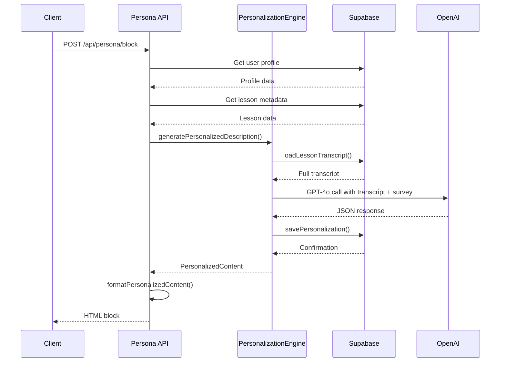
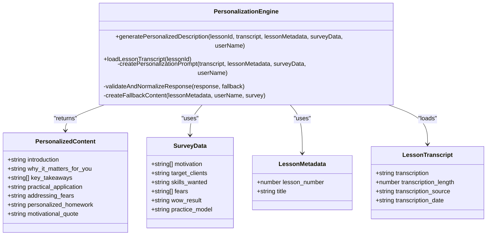
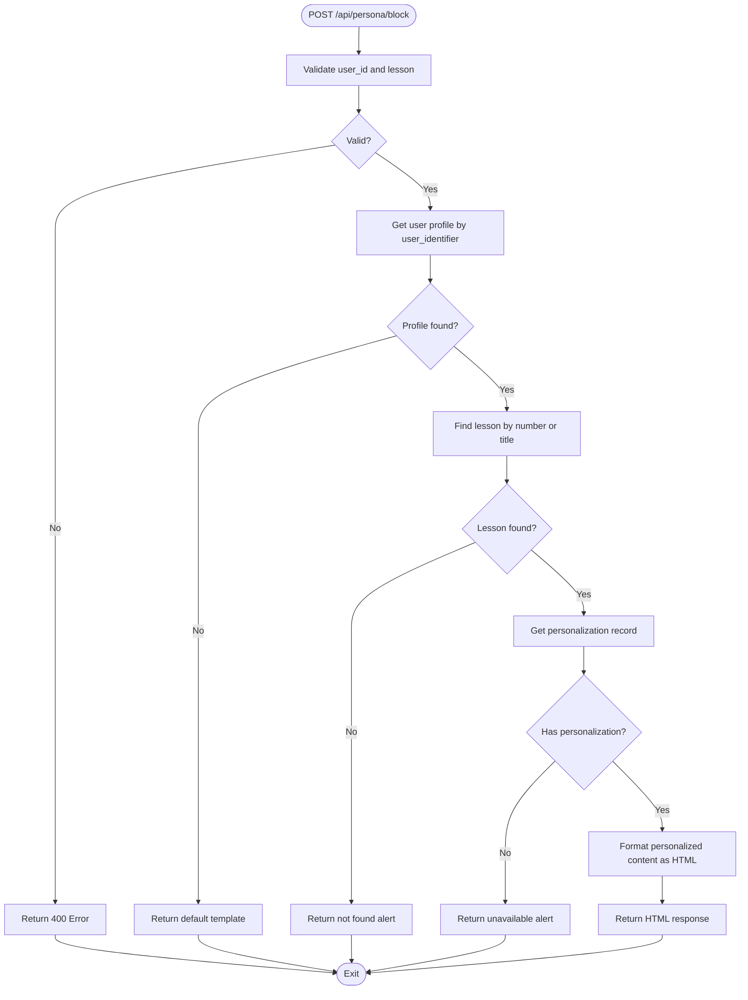
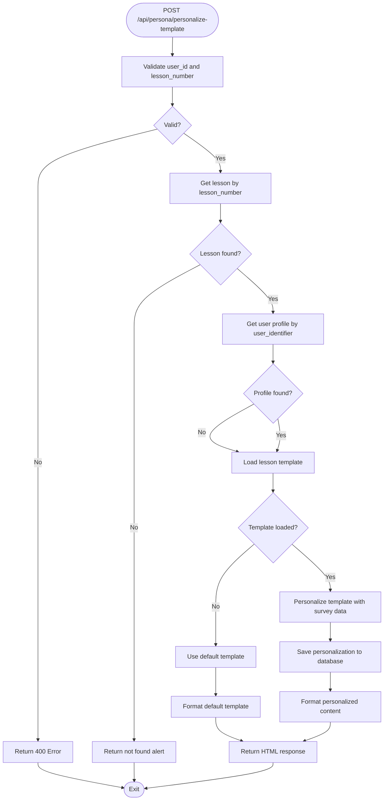
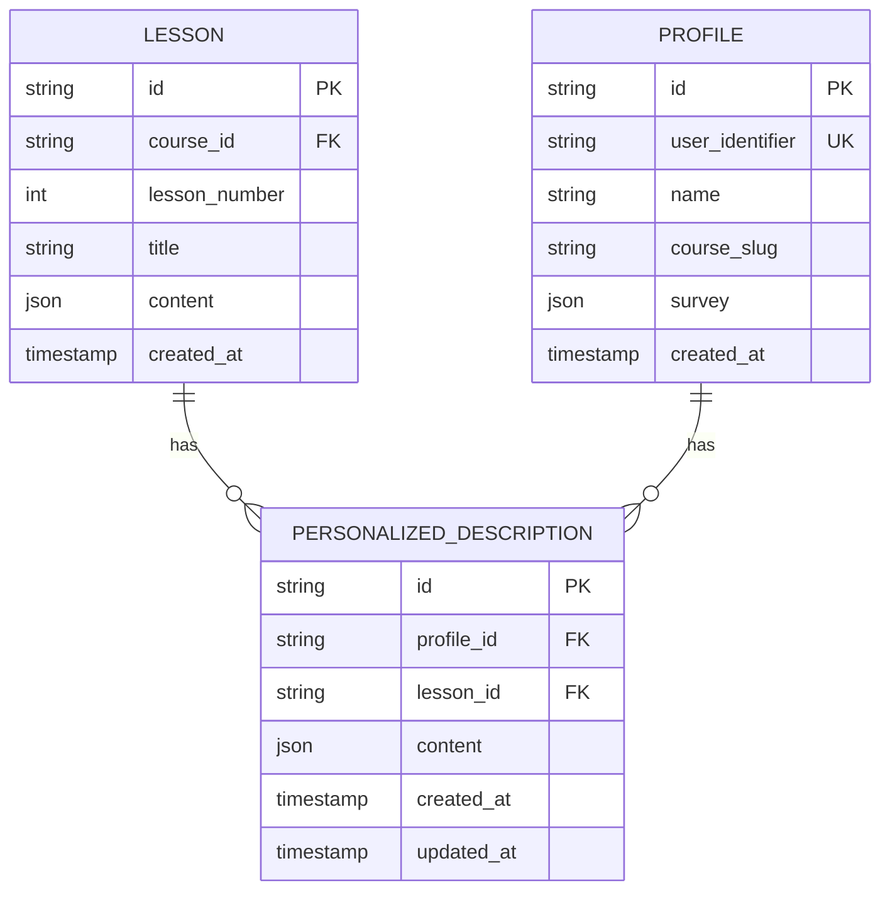
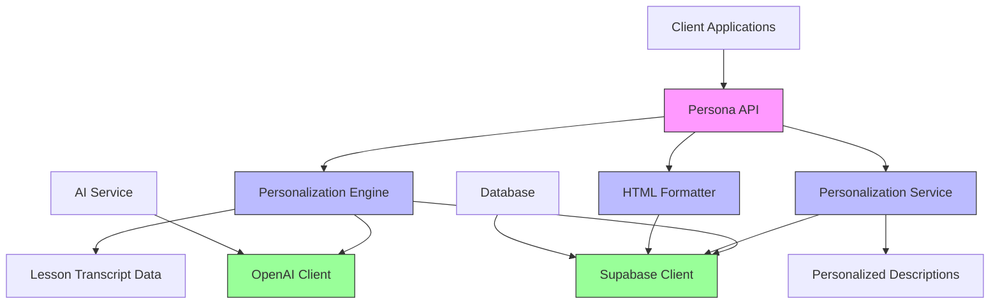

# Personalization Engine Service

<cite>
**Referenced Files in This Document**   
- [personalization-engine.ts](file://lib/services/personalization-engine.ts)
- [personalize-template/route.ts](file://app/api/persona/personalize-template/route.ts)
- [block/route.ts](file://app/api/persona/block/route.ts)
- [personalization.ts](file://lib/services/personalization.ts)
- [openai.ts](file://lib/services/openai.ts)
- [html-formatter.ts](file://lib/services/html-formatter.ts)
- [lesson-templates.ts](file://lib/services/lesson-templates.ts)
- [types.ts](file://lib/supabase/types.ts)
</cite>

## Table of Contents
1. [Introduction](#introduction)
2. [Project Structure](#project-structure)
3. [Core Components](#core-components)
4. [Architecture Overview](#architecture-overview)
5. [Detailed Component Analysis](#detailed-component-analysis)
6. [Dependency Analysis](#dependency-analysis)
7. [Performance Considerations](#performance-considerations)
8. [Troubleshooting Guide](#troubleshooting-guide)
9. [Conclusion](#conclusion)

## Introduction
The Personalization Engine Service is a core component of the educational platform designed to deliver deeply personalized lesson descriptions based on individual student profiles and full lesson transcripts. It leverages AI (GPT-4o) to generate rich, context-aware content that enhances student engagement and learning outcomes. The service has undergone a major refactoring to move from template-based personalization to direct generation from full transcripts, significantly improving content quality and relevance.

## Project Structure
The service is organized within a Next.js application structure with clear separation of concerns. Key directories include:
- `app/api/persona/`: API routes for personalization
- `lib/services/`: Core business logic and service implementations
- `lib/supabase/`: Database interaction layer
- `components/`: UI components for rendering personalized content
- `public/`: Static assets and HTML templates

```mermaid
graph TB
subgraph "API Endpoints"
A[/api/persona/block]
B[/api/persona/personalize-template]
end
subgraph "Core Services"
C[personalization-engine.ts]
D[personalization.ts]
E[html-formatter.ts]
end
subgraph "Data Layer"
F[Supabase Database]
G[lesson_transcripts]
H[personalized_descriptions]
end
A --> D
B --> C
C --> F
D --> F
C --> E
D --> E
F --> G
F --> H
```

**Diagram sources**
- [personalization-engine.ts](file://lib/services/personalization-engine.ts)
- [block/route.ts](file://app/api/persona/block/route.ts)
- [personalize-template/route.ts](file://app/api/persona/personalize-template/route.ts)

**Section sources**
- [personalization-engine.ts](file://lib/services/personalization-engine.ts)
- [types.ts](file://lib/supabase/types.ts)

## Core Components
The Personalization Engine Service consists of several key components that work together to deliver personalized content. The core functionality is centered around generating rich, individualized lesson descriptions by analyzing full lesson transcripts against detailed student profiles. The system has been refactored to process complete transcripts directly, eliminating information loss from intermediate template generation.

**Section sources**
- [personalization-engine.ts](file://lib/services/personalization-engine.ts)
- [personalization.ts](file://lib/services/personalization.ts)

## Architecture Overview
The Personalization Engine follows a service-oriented architecture with clear separation between API interfaces, business logic, and data access. The system processes requests through API endpoints that coordinate with various services to generate and deliver personalized content. It uses Supabase as the primary data store for lesson transcripts, student profiles, and generated personalizations.



**Diagram sources**
- [block/route.ts](file://app/api/persona/block/route.ts)
- [personalization-engine.ts](file://lib/services/personalization-engine.ts)
- [personalization.ts](file://lib/services/personalization.ts)

## Detailed Component Analysis

### Personalization Engine Analysis
The Personalization Engine is the core service responsible for generating rich, personalized lesson descriptions by analyzing full lesson transcripts against student profiles in a single AI call. This represents a significant improvement over the previous template-based approach.



**Diagram sources**
- [personalization-engine.ts](file://lib/services/personalization-engine.ts)

**Section sources**
- [personalization-engine.ts](file://lib/services/personalization-engine.ts)

### API Endpoints Analysis
The service exposes two primary API endpoints for retrieving personalized content. These endpoints handle different use cases and request patterns while sharing common functionality for personalization retrieval and HTML generation.

#### Persona Block Endpoint


**Diagram sources**
- [block/route.ts](file://app/api/persona/block/route.ts)

**Section sources**
- [block/route.ts](file://app/api/persona/block/route.ts)

#### Personalize Template Endpoint


**Diagram sources**
- [personalize-template/route.ts](file://app/api/persona/personalize-template/route.ts)

**Section sources**
- [personalize-template/route.ts](file://app/api/persona/personalize-template/route.ts)

### Data Management Analysis
The service interacts with Supabase database to manage lesson transcripts, student profiles, and personalized content. The data schema is designed to support efficient querying and storage of structured content.



**Diagram sources**
- [types.ts](file://lib/supabase/types.ts)

**Section sources**
- [types.ts](file://lib/supabase/types.ts)

## Dependency Analysis
The Personalization Engine Service has a well-defined dependency structure with clear boundaries between components. The service relies on external systems for AI processing and data storage, while maintaining internal cohesion through well-defined interfaces.



**Diagram sources**
- [personalization-engine.ts](file://lib/services/personalization-engine.ts)
- [personalization.ts](file://lib/services/personalization.ts)
- [openai.ts](file://lib/services/openai.ts)

**Section sources**
- [personalization-engine.ts](file://lib/services/personalization-engine.ts)
- [personalization.ts](file://lib/services/personalization.ts)
- [openai.ts](file://lib/services/openai.ts)

## Performance Considerations
The Personalization Engine is designed with performance and reliability in mind. The system implements fallback mechanisms, retry logic, and error handling to ensure consistent service availability. Generation time is optimized by using GPT-4o with appropriate token limits and temperature settings. The service also includes caching considerations through the flush parameter in API requests, allowing clients to control whether cached content should be used.

The engine processes full transcripts (8-18k characters) in a single AI call, which requires careful management of token usage and response times. The system includes validation for transcript length and implements a fallback content mechanism when transcripts are too short or AI generation fails. Retry logic with adjusted temperature settings provides additional resilience against transient API issues.

**Section sources**
- [personalization-engine.ts](file://lib/services/personalization-engine.ts)

## Troubleshooting Guide
When troubleshooting issues with the Personalization Engine Service, consider the following common scenarios and their solutions:

**Section sources**
- [personalization-engine.ts](file://lib/services/personalization-engine.ts)
- [block/route.ts](file://app/api/persona/block/route.ts)
- [personalize-template/route.ts](file://app/api/persona/personalize-template/route.ts)

### API Request Validation
Ensure that API requests include all required parameters. The `/api/persona/block` endpoint requires `user_id` and `lesson` parameters, while `/api/persona/personalize-template` requires `user_id` and `lesson_number`. Missing parameters will result in 400 Bad Request responses.

### Profile and Lesson Resolution
The service attempts to resolve lessons by number first, then by title. If a lesson cannot be found, verify that the lesson exists in the database with the expected number or title. User profiles are identified by `user_identifier`, so ensure this value matches the stored profile.

### Personalization Generation Failures
If personalization generation fails, the system will return fallback content. Check server logs for errors from the OpenAI API or database queries. The system implements a retry mechanism with lower temperature settings when the initial generation fails.

### HTML Formatting Issues
The HTML formatter handles multiple content formats (new, old, alternative) and converts them to consistent HTML output. If formatting issues occur, verify that the personalization content matches the expected structure and that all text is properly escaped to prevent XSS vulnerabilities.

## Conclusion
The Personalization Engine Service represents a significant advancement in delivering personalized educational content. By moving from template-based personalization to direct generation from full transcripts, the service can create richer, more relevant lesson descriptions that better serve individual student needs. The architecture is robust, with clear separation of concerns, comprehensive error handling, and fallback mechanisms. The service integrates seamlessly with the broader platform through well-defined API endpoints and data structures, providing a foundation for continued improvement in student engagement and learning outcomes.