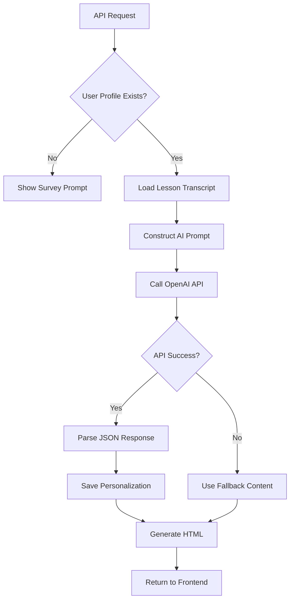
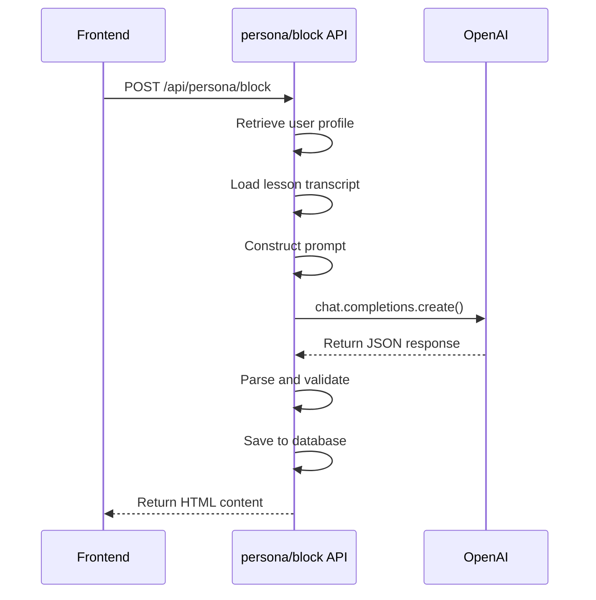
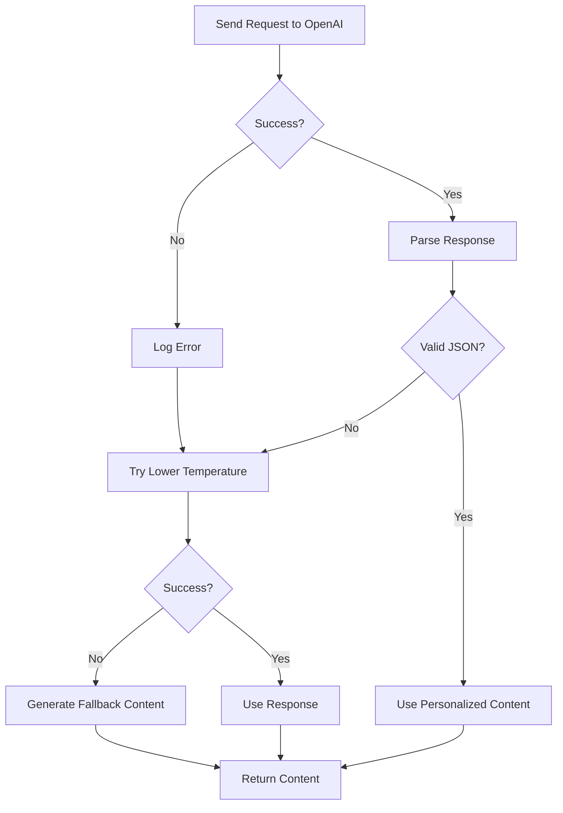

# AI Processing Workflow

<cite>
**Referenced Files in This Document**   
- [lib/services/personalization-engine.ts](file://lib/services/personalization-engine.ts) - *Updated in commit d0cc268*
- [app/api/persona/block/route.ts](file://app/api/persona/block/route.ts) - *Updated in commit d0cc268*
- [lib/services/personalization.ts](file://lib/services/personalization.ts) - *Updated in commit d0cc268*
- [lib/services/html-formatter.ts](file://lib/services/html-formatter.ts) - *Updated in commit d0cc268*
- [store/shvz/lessons/01/lesson.json](file://store/shvz/lessons/01/lesson.json)
</cite>

## Update Summary
**Changes Made**   
- Completely overhauled the AI processing workflow to use direct transcript analysis instead of template-based generation
- Updated all sections to reflect the new architecture using GPT-4o with full lesson transcripts
- Added new content for the 7-section personalization structure and transcript-based processing
- Removed outdated information about template files and GPT-4o-mini
- Updated code examples, diagrams, and configuration parameters to match current implementation

## Table of Contents
1. [Introduction](#introduction)
2. [AI Processing Workflow Overview](#ai-processing-workflow-overview)
3. [Prompt Construction and Engineering Strategy](#prompt-construction-and-engineering-strategy)
4. [OpenAI API Integration and Configuration](#openai-api-integration-and-configuration)
5. [Response Handling and JSON Parsing](#response-handling-and-json-parsing)
6. [Error Handling and Fallback Mechanisms](#error-handling-and-fallback-mechanisms)
7. [HTML Rendering and Frontend Integration](#html-rendering-and-frontend-integration)
8. [Configuration Parameters](#configuration-parameters)
9. [Example Input and Output](#example-input-and-output)
10. [Customization and Template Adaptation](#customization-and-template-adaptation)

## Introduction
The AI processing workflow is the core of the personalization engine, responsible for transforming full lesson transcripts into personalized learning experiences based on user survey data. This system leverages OpenAI's GPT-4o model to generate tailored content that addresses individual student motivations, goals, fears, and practice models by analyzing complete lesson transcripts rather than compressed templates. The workflow integrates seamlessly with the application's backend and frontend, delivering dynamic, context-aware educational content through a robust API architecture.

**Section sources**
- [lib/services/personalization-engine.ts](file://lib/services/personalization-engine.ts#L1-L50)

## AI Processing Workflow Overview
The AI processing workflow follows a structured sequence to deliver personalized lesson content:
1. Receive user ID and lesson identifier via API request
2. Retrieve user profile and survey data from Supabase
3. Load the lesson transcript from the database (not from template files)
4. Construct a detailed prompt combining full transcript data and user survey responses
5. Send the prompt to OpenAI's GPT-4o model for direct generation
6. Parse and validate the JSON response
7. Store the personalized content in the database
8. Format the content as HTML for frontend display

This end-to-end process ensures that each student receives content specifically tailored to their learning context, while maintaining a consistent structure across all lessons. The key innovation is the elimination of the intermediate template generation step, allowing the AI to work with complete lesson transcripts (8,000-18,000 characters) rather than compressed summaries.



**Diagram sources**
- [lib/services/personalization-engine.ts](file://lib/services/personalization-engine.ts#L267-L370)
- [app/api/persona/block/route.ts](file://app/api/persona/block/route.ts#L50-L100)

## Prompt Construction and Engineering Strategy
The prompt engineering strategy is designed to produce consistent, high-quality personalized content by providing clear role definition, structured context, and strict output requirements.

### Role Definition
The AI is explicitly assigned the role of "an experienced massage course methodologist and copywriter," establishing authority and domain expertise.

### Context Formatting
The prompt combines two critical data sources:
- **Lesson Transcript**: Full lesson content (8,000-18,000 characters) from the database
- **User Survey Data**: Personal information including:
  - Student name
  - Motivation
  - Target clients
  - Desired skills
  - Fears/concerns
  - Expected results (wow_result)
  - Practice model

### Instruction Framework
The prompt includes specific instructions to:
1. Address the student by name
2. Incorporate the student's motivation and goals
3. Address stated fears and concerns with specific techniques from the transcript
4. Adapt homework to the practice model
5. Connect content to expected outcomes
6. Reference specific techniques and moments from the full transcript

### Output Requirements
Strict formatting requirements ensure consistency:
- Must return only valid JSON
- Must not include any additional text or explanations
- Must follow the specified 7-section JSON schema
- Must be self-contained and complete

**Section sources**
- [lib/services/personalization-engine.ts](file://lib/services/personalization-engine.ts#L120-L265)

## OpenAI API Integration and Configuration
The system integrates with OpenAI through the official SDK, using a configured client instance with proper API key management.

### Client Initialization
The OpenAI client is initialized with the API key from environment variables, ensuring secure credential handling.

### Request Structure
API requests are structured with:
- **Model**: gpt-4o for superior long-context understanding (replaces gpt-4o-mini)
- **Message Sequence**: System message defining role and constraints, followed by user message containing the full prompt with transcript
- **Parameters**: Configured temperature, token limits, and JSON response format

### API Endpoint
The integration occurs through the chat completions endpoint, which supports the instruction-following capabilities required for this use case.



**Diagram sources**
- [lib/services/personalization-engine.ts](file://lib/services/personalization-engine.ts#L267-L370)
- [app/api/persona/block/route.ts](file://app/api/persona/block/route.ts#L50-L100)

## Response Handling and JSON Parsing
The system implements robust response handling to ensure reliable operation despite potential API issues.

### Response Structure
The expected JSON response includes seven sections:
- `introduction`: Personalized lesson introduction addressing the student by name
- `why_it_matters_for_you`: Rationale connecting lesson content to student's goals and fears
- `key_takeaways`: 3-4 specific learning outcomes extracted from the transcript
- `practical_application`: How techniques apply to the student's practice model
- `addressing_fears`: Direct response to student's stated fears with transcript references
- `personalized_homework`: Homework assignment tailored to practice model
- `motivational_quote`: Inspirational quote referencing the student's wow_result

### Parsing Logic
The response parsing includes:
- Extracting the message content from the completion object
- Cleaning potential markdown code blocks (```json)
- Attempting JSON parsing with error handling
- Validating and normalizing the response structure
- Providing fallback content on parse failure

### Data Validation
The system performs validation to ensure the response contains the expected structure before use, with normalization to handle array/string inconsistencies.

**Section sources**
- [lib/services/personalization-engine.ts](file://lib/services/personalization-engine.ts#L267-L370)

## Error Handling and Fallback Mechanisms
The system implements comprehensive error handling to maintain functionality during AI service failures.

### Primary Error Scenarios
- OpenAI API unavailability
- Invalid JSON response
- Network connectivity issues
- Rate limiting
- Empty or short transcripts

### Fallback Strategy
When the AI service fails, the system implements a multi-tiered fallback:
1. **First retry**: Call GPT-4o again with lower temperature (0.5)
2. **Final fallback**: Generate basic personalized content using available data
3. **Database fallback**: Return existing personalization if available

The fallback content maintains the same structure but with less personalized, more generic content.

### Error Logging
All errors are logged for monitoring and debugging purposes, including:
- Lesson ID and user context
- Error messages and stack traces
- Timestamps
- Retry attempts

### User Experience
The fallback mechanism ensures users always receive content, even if not fully personalized, with clear indications when personalization quality may be reduced.



**Diagram sources**
- [lib/services/personalization-engine.ts](file://lib/services/personalization-engine.ts#L267-L370)

## HTML Rendering and Frontend Integration
The personalized content is transformed into HTML for seamless frontend integration.

### Content Formatting
The `formatPersonalizedContent` function converts the JSON response into structured HTML with:
- Semantic class names for styling
- Conditional section rendering
- Proper escaping to prevent XSS
- Consistent visual hierarchy
- Format detection and conversion (supports old 5-field, alternative, and new 7-section formats)

### Frontend Implementation
The frontend uses a JavaScript snippet to:
- Identify lesson containers by data attributes
- Call the personalization API
- Inject returned HTML
- Load required CSS styles

### Template Integration
The system no longer relies on static template files. Instead, it uses the database-stored transcripts and generates HTML dynamically based on the AI response structure.

**Section sources**
- [lib/services/html-formatter.ts](file://lib/services/html-formatter.ts#L22-L143)
- [app/api/persona/block/route.ts](file://app/api/persona/block/route.ts#L100-L140)

## Configuration Parameters
The AI processing workflow uses carefully tuned configuration parameters to balance creativity and consistency.

### Model Selection
- **Model**: gpt-4o
- **Rationale**: Superior long-context understanding for processing 8-18k character transcripts; stronger semantic analysis for matching lesson content to student profiles

### Temperature
- **Value**: 0.7 (0.5 for retry)
- **Effect**: Moderate creativity with reasonable consistency
- **Trade-off**: Allows for personalized expression while maintaining structural integrity

### Token Limits
- **Max Tokens**: 2500
- **Purpose**: Ensures complete responses within reasonable length
- **Constraint**: Accommodates rich, detailed descriptions across 7 fields

### System Message
- Defines the AI's role as a course methodologist and copywriter
- Specifies JSON-only output requirement
- Establishes the professional tone

### Response Format
- **Format**: JSON object mode
- **Purpose**: Ensures structured, parseable output without markdown wrappers

**Section sources**
- [lib/services/personalization-engine.ts](file://lib/services/personalization-engine.ts#L267-L370)

## Example Input and Output
This section illustrates the transformation from input data to AI-generated output.

### Input Data
**User Survey Data:**
- Name: Maria
- Motivation: Career change to massage therapy
- Target clients: Office workers with back pain
- Desired skills: Deep tissue techniques
- Fears: Causing client discomfort
- Expected result: Confident practice within 3 months
- Practice model: Friend with desk job

**Lesson Transcript Snippet:**
```
"В этом уроке мы рассмотрим технику глубокого массажа спины. Начнем с разогревающих движений, затем перейдем к работе с мышцами трапециевидной группы. Важно контролировать давление, особенно при работе с новичками. Покажу, как адаптировать технику для клиентов с сидячей работой..."
```

### Generated Output
```json
{
  "introduction": "Привет, Maria! В этом уроке вы освоите технику глубокого массажа спины, которая поможет вам в карьере массажиста.",
  "why_it_matters_for_you": "Этот урок особенно важен для вас, так как вы хотите работать с офисными сотрудниками. Вы научитесь техникам, которые помогут снять напряжение в спине у клиентов с сидячей работой. Урок даст вам уверенность в работе с новичками, что поможет преодолеть ваш страх причинить дискомфорт.",
  "key_takeaways": [
    "Вы узнаете технику разогревающих движений для спины",
    "Вы научитесь работать с мышцами трапециевидной группы",
    "Вы поймете, как контролировать давление при массаже"
  ],
  "practical_application": "После урока вы сможете применять эти техники с вашим другом, который работает за компьютером. Начните с легких разогревающих движений, затем переходите к более глубокой работе, контролируя давление.",
  "addressing_fears": "В уроке подробно объясняется, как контролировать давление и адаптировать технику для новичков. Это поможет вам избежать причинения дискомфорта клиентам.",
  "personalized_homework": "1. Просмотрите видео урока. 2. Попрактикуйтесь с другом, начиная с разогревающих движений. 3. Обратите внимание на его реакцию на давление. 4. Запишите свои наблюдения.",
  "motivational_quote": "Каждый урок приближает вас к цели: уверенной практике в массаже!"
}
```

**Section sources**
- [lib/services/personalization-engine.ts](file://lib/services/personalization-engine.ts#L120-L265)
- [GETCOURSE_INTEGRATION.md](file://GETCOURSE_INTEGRATION.md#L128-L163)

## Customization and Template Adaptation
The system supports adaptation for different teaching styles and content formats while maintaining JSON schema integrity.

### Teaching Style Modifications
The prompt can be adjusted to reflect different instructor personas by modifying:
- The role definition in the system message
- The tone and language in the instructions
- The emphasis on different aspects of teaching

### Content Format Extensions
Additional content sections can be added by:
- Extending the JSON schema in the prompt instructions
- Updating the HTML formatting function
- Modifying the database schema

### Schema Integrity
The system maintains backward compatibility by:
- Supporting multiple content formats (old 5-field, alternative, new 7-section)
- Automatically converting between formats in the HTML formatter
- Providing default values for missing fields
- Using consistent field naming conventions

### Template Evolution
The system no longer uses static template files. Lesson content is derived directly from full transcripts stored in the database, enabling deeper personalization and eliminating the information bottleneck of the previous template-based approach.

**Section sources**
- [lib/services/personalization-engine.ts](file://lib/services/personalization-engine.ts#L267-L370)
- [lib/services/html-formatter.ts](file://lib/services/html-formatter.ts#L22-L143)