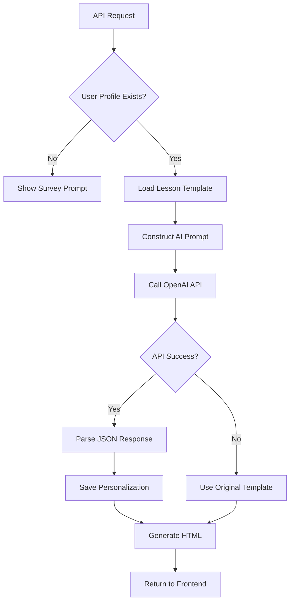
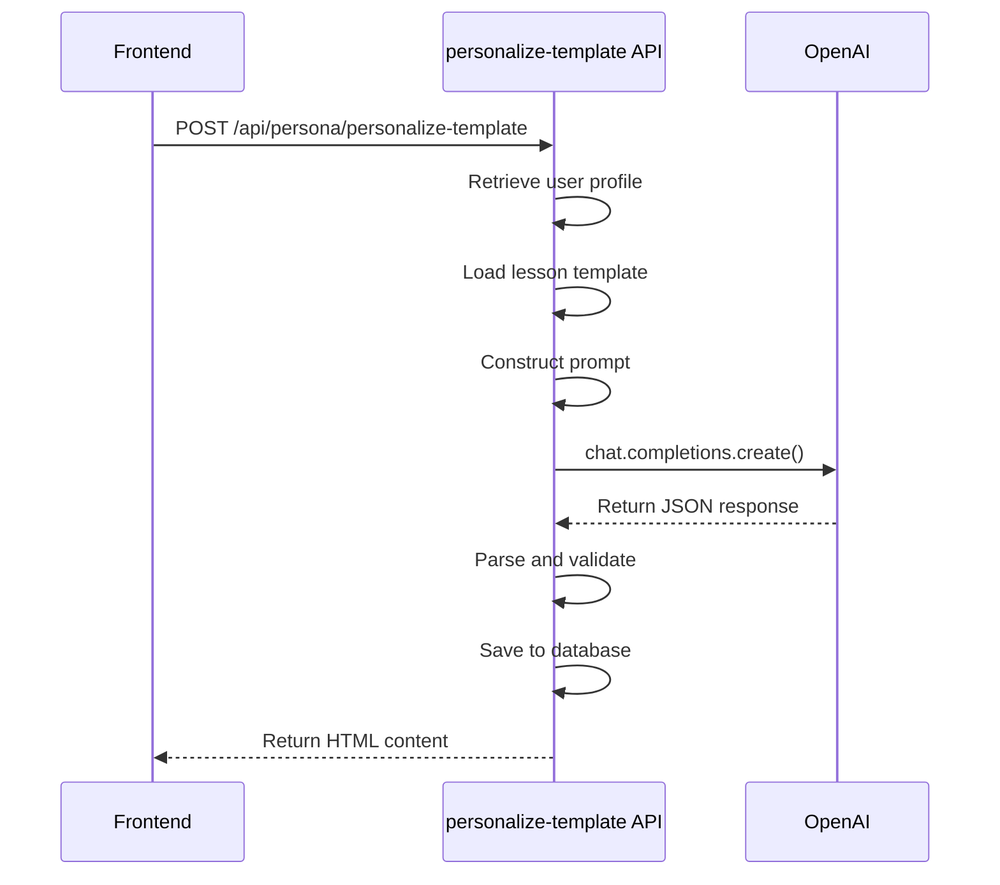
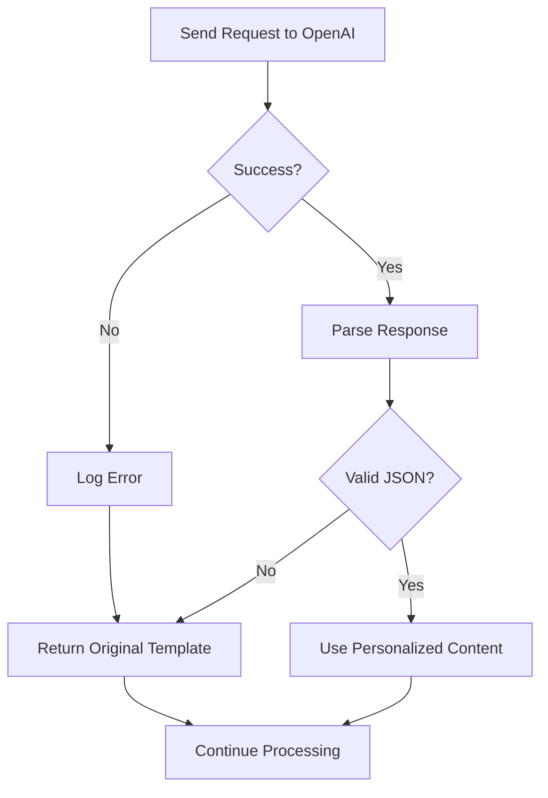

# AI Processing Workflow

<cite>
**Referenced Files in This Document**   
- [lib/openai.ts](file://lib/openai.ts)
- [app/api/persona/personalize-template/route.ts](file://app/api/persona/personalize-template/route.ts)
- [app/api/persona/block/route.ts](file://app/api/persona/block/route.ts)
- [public/getcourse/lesson-block-template.html](file://public/getcourse/lesson-block-template.html)
- [store/shvz/lessons/01/lesson.json](file://store/shvz/lessons/01/lesson.json)
</cite>

## Table of Contents
1. [Introduction](#introduction)
2. [AI Processing Workflow Overview](#ai-processing-workflow-overview)
3. [Prompt Construction and Engineering Strategy](#prompt-construction-and-engineering-strategy)
4. [OpenAI API Integration and Configuration](#openai-api-integration-and-configuration)
5. [Response Handling and JSON Parsing](#response-handling-and-json-parsing)
6. [Error Handling and Fallback Mechanisms](#error-handling-and-fallback-mechanisms)
7. [HTML Rendering and Frontend Integration](#html-rendering-and-frontend-integration)
8. [Configuration Parameters](#configuration-parameters)
9. [Example Input and Output](#example-input-and-output)
10. [Customization and Template Adaptation](#customization-and-template-adaptation)

## Introduction
The AI processing workflow is the core of the personalization engine, responsible for transforming static lesson templates into personalized learning experiences based on user survey data. This system leverages OpenAI's GPT-4o-mini model to generate tailored content that addresses individual student motivations, goals, fears, and practice models. The workflow integrates seamlessly with the application's backend and frontend, delivering dynamic, context-aware educational content through a robust API architecture.

**Section sources**
- [app/api/persona/personalize-template/route.ts](file://app/api/persona/personalize-template/route.ts#L1-L50)

## AI Processing Workflow Overview
The AI processing workflow follows a structured sequence to deliver personalized lesson content:
1. Receive user ID and lesson number via API request
2. Retrieve user profile and survey data from Supabase
3. Load the appropriate lesson template from the local filesystem
4. Construct a detailed prompt combining template data and user survey responses
5. Send the prompt to OpenAI's GPT-4o-mini model
6. Parse and validate the JSON response
7. Store the personalized content in the database
8. Format the content as HTML for frontend display

This end-to-end process ensures that each student receives content specifically tailored to their learning context, while maintaining a consistent structure across all lessons.



**Diagram sources**
- [app/api/persona/personalize-template/route.ts](file://app/api/persona/personalize-template/route.ts#L50-L150)

## Prompt Construction and Engineering Strategy
The prompt engineering strategy is designed to produce consistent, high-quality personalized content by providing clear role definition, structured context, and strict output requirements.

### Role Definition
The AI is explicitly assigned the role of "Anastasia Fomina, an experienced massage instructor," establishing authority and domain expertise.

### Context Formatting
The prompt combines two critical data sources:
- **Lesson Template**: Original lesson content in JSON format
- **User Survey Data**: Personal information including:
  - Student name
  - Motivation
  - Target clients
  - Desired skills
  - Fears/concerns
  - Expected results
  - Practice model

### Instruction Framework
The prompt includes specific instructions to:
1. Address the student by name
2. Incorporate the student's motivation and goals
3. Address stated fears and concerns
4. Adapt homework to the practice model
5. Connect content to expected outcomes

### Output Requirements
Strict formatting requirements ensure consistency:
- Must return only valid JSON
- Must not include any additional text or explanations
- Must follow the specified JSON schema
- Must be self-contained and complete

**Section sources**
- [app/api/persona/personalize-template/route.ts](file://app/api/persona/personalize-template/route.ts#L172-L230)

## OpenAI API Integration and Configuration
The system integrates with OpenAI through the official SDK, using a configured client instance with proper API key management.

### Client Initialization
The OpenAI client is initialized with the API key from environment variables, ensuring secure credential handling.

### Request Structure
API requests are structured with:
- **Model**: gpt-4o-mini for optimal cost-performance balance
- **Message Sequence**: System message defining role and constraints, followed by user message containing the full prompt
- **Parameters**: Configured temperature and token limits

### API Endpoint
The integration occurs through the chat completions endpoint, which supports the instruction-following capabilities required for this use case.



**Diagram sources**
- [lib/openai.ts](file://lib/openai.ts#L1-L8)
- [app/api/persona/personalize-template/route.ts](file://app/api/persona/personalize-template/route.ts#L200-L230)

## Response Handling and JSON Parsing
The system implements robust response handling to ensure reliable operation despite potential API issues.

### Response Structure
The expected JSON response includes:
- `summary_short`: Personalized lesson summary
- `why_watch`: Rationale for watching the lesson
- `quick_action`: Immediate action item
- `social_share`: Social media sharing message
- `homework_20m`: 20-minute homework assignment

### Parsing Logic
The response parsing includes:
- Extracting the message content from the completion object
- Attempting JSON parsing with error handling
- Providing default empty object on parse failure

### Data Validation
While the system trusts the AI to follow instructions, it performs basic validation to ensure the response contains the expected structure before use.

**Section sources**
- [app/api/persona/personalize-template/route.ts](file://app/api/persona/personalize-template/route.ts#L215-L230)

## Error Handling and Fallback Mechanisms
The system implements comprehensive error handling to maintain functionality during AI service failures.

### Primary Error Scenarios
- OpenAI API unavailability
- Invalid JSON response
- Network connectivity issues
- Rate limiting

### Fallback Strategy
When the AI service fails, the system implements a graceful fallback:
- Returns the original template content without personalization
- Maintains application functionality
- Prevents complete service disruption

### Error Logging
All errors are logged for monitoring and debugging purposes, including:
- API request details
- Error messages
- Timestamps
- User context

### User Experience
The fallback mechanism ensures users always receive content, even if not personalized, with clear indications when personalization is unavailable.



**Diagram sources**
- [app/api/persona/personalize-template/route.ts](file://app/api/persona/personalize-template/route.ts#L225-L230)

## HTML Rendering and Frontend Integration
The personalized content is transformed into HTML for seamless frontend integration.

### Content Formatting
The `formatPersonalizedContent` function converts the JSON response into structured HTML with:
- Semantic class names for styling
- Conditional section rendering
- Proper escaping to prevent XSS
- Consistent visual hierarchy

### Frontend Implementation
The frontend uses a JavaScript snippet to:
- Identify lesson containers by data attributes
- Call the personalization API
- Inject returned HTML
- Load required CSS styles

### Template Integration
The `lesson-block-template.html` provides a reusable pattern for integrating personalized content into GetCourse pages, requiring only lesson-specific parameter substitution.

**Section sources**
- [app/api/persona/personalize-template/route.ts](file://app/api/persona/personalize-template/route.ts#L235-L281)
- [public/getcourse/lesson-block-template.html](file://public/getcourse/lesson-block-template.html#L1-L60)

## Configuration Parameters
The AI processing workflow uses carefully tuned configuration parameters to balance creativity and consistency.

### Model Selection
- **Model**: gpt-4o-mini
- **Rationale**: Optimal balance of capability, speed, and cost for this use case

### Temperature
- **Value**: 0.7
- **Effect**: Moderate creativity with reasonable consistency
- **Trade-off**: Allows for personalized expression while maintaining structural integrity

### Token Limits
- **Max Tokens**: 1000
- **Purpose**: Ensures complete responses within reasonable length
- **Constraint**: Prevents excessively long outputs that might impact performance

### System Message
- Defines the AI's role as a massage instructor
- Specifies JSON-only output requirement
- Establishes the professional tone

**Section sources**
- [app/api/persona/personalize-template/route.ts](file://app/api/persona/personalize-template/route.ts#L208-L218)

## Example Input and Output
This section illustrates the transformation from input data to AI-generated output.

### Input Data
**User Survey Data:**
- Name: Maria
- Motivation: Career change to massage therapy
- Target clients: Office workers with back pain
- Desired skills: Deep tissue techniques
- Fears: Causing client discomfort
- Expected result: Confident practice within 3 months
- Practice model: Friend with desk job

**Lesson Template:**
```json
{
  "number": 1,
  "title": "Introduction to Massage Techniques",
  "duration": "30 minutes"
}
```

### Generated Output
```json
{
  "summary_short": "Привет, Maria! Этот урок поможет вам начать путь к карьере в массаже.",
  "why_watch": "Этот урок важен для вашей цели работать с офисными сотрудниками. Вы научитесь техникам, которые помогут снять напряжение в спине.",
  "quick_action": "После просмотра видео попробуйте основные движения на своем друге с учетом его работы за компьютером.",
  "social_share": "Начинаю обучение массажу для помощи офисным работникам с болями в спине!",
  "homework_20m": "1. Просмотрите видео урока. 2. Попрактикуйтесь с другом, объяснив каждое движение. 3. Обратите внимание на его реакцию. 4. Запишите свои наблюдения."
}
```

**Section sources**
- [app/api/persona/personalize-template/route.ts](file://app/api/persona/personalize-template/route.ts#L172-L230)
- [GETCOURSE_INTEGRATION.md](file://GETCOURSE_INTEGRATION.md#L128-L163)

## Customization and Template Adaptation
The system supports adaptation for different teaching styles and content formats while maintaining JSON schema integrity.

### Teaching Style Modifications
The prompt can be adjusted to reflect different instructor personas by modifying:
- The role definition in the system message
- The tone and language in the instructions
- The emphasis on different aspects of teaching

### Content Format Extensions
Additional content sections can be added by:
- Extending the JSON schema in the prompt instructions
- Updating the HTML formatting function
- Modifying the database schema

### Schema Integrity
The system maintains backward compatibility by:
- Making new fields optional
- Providing default values for missing fields
- Using consistent field naming conventions
- Validating output structure

### Template Evolution
Lesson templates can be updated without breaking the personalization system by:
- Maintaining core structural elements
- Adding new data fields incrementally
- Providing migration paths for existing content

**Section sources**
- [app/api/persona/personalize-template/route.ts](file://app/api/persona/personalize-template/route.ts#L172-L230)
- [app/api/persona/personalize-template/route.ts](file://app/api/persona/personalize-template/route.ts#L235-L281)