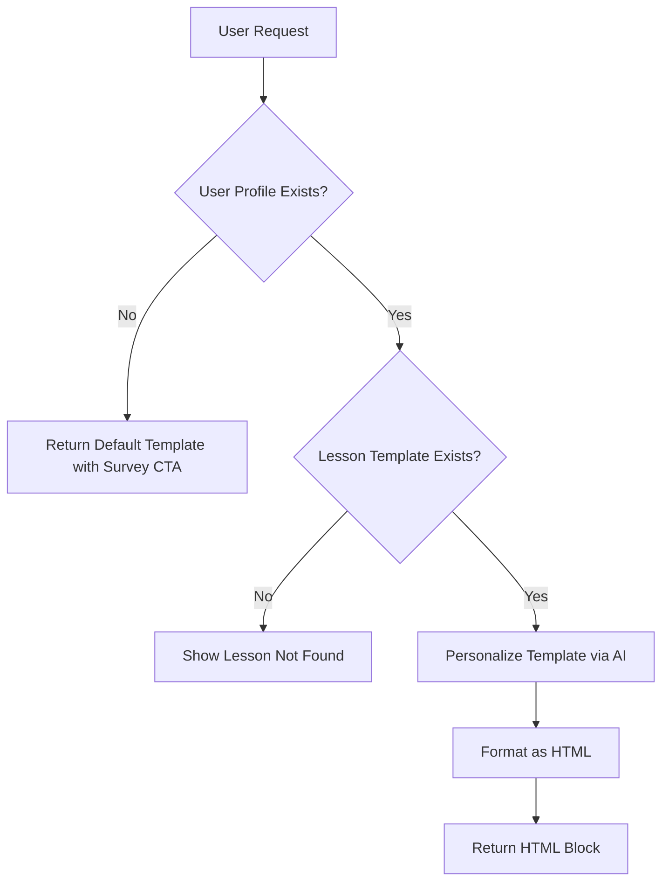
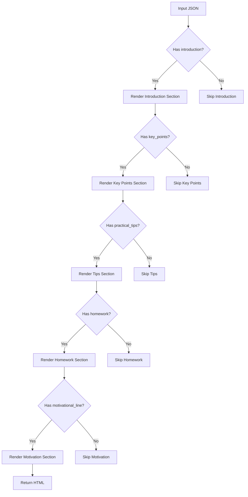
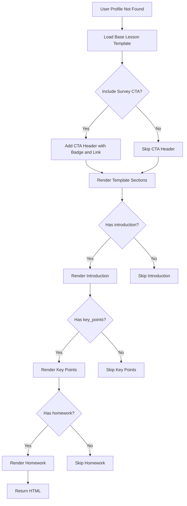
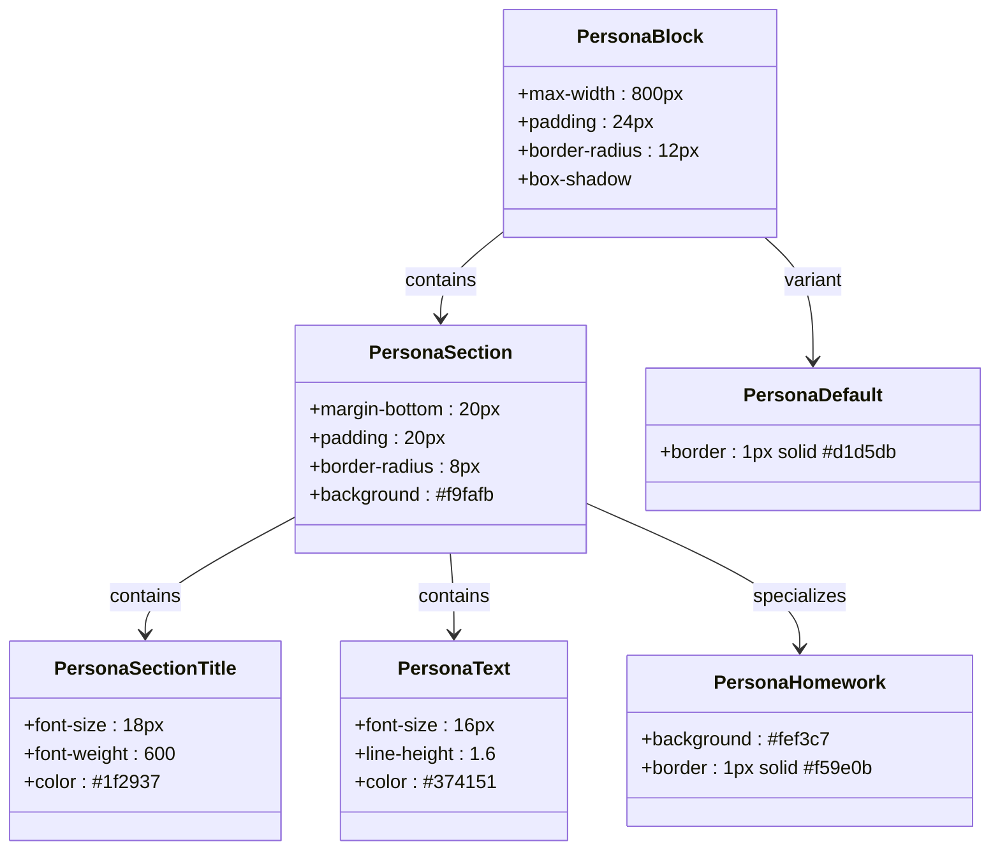
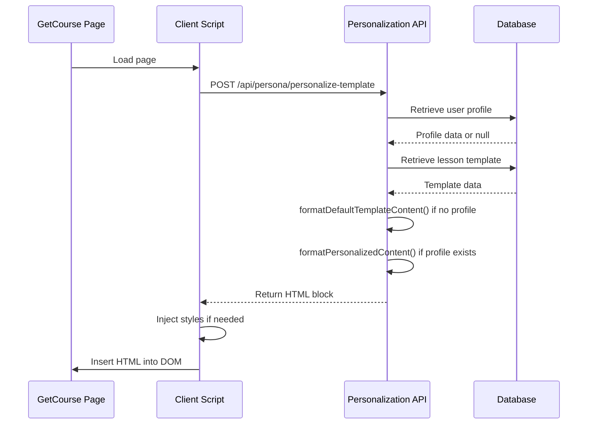

# HTML Output Generation

<cite>
**Referenced Files in This Document**   
- [route.ts](file://app/api/persona/personalize-template/route.ts) - *Updated to include default template fallback*
- [html-formatter.ts](file://lib/services/html-formatter.ts) - *Added formatDefaultTemplateContent function*
- [styles.css](file://public/persona/styles.css) - *Styling for default template and alert states*
- [GETCOURSE_INTEGRATION.md](file://GETCOURSE_INTEGRATION.md) - *Integration guidance remains valid*
- [1-c8a90762-6fca-47a8-80c3-5f454ae05273-final.json](file://store/shvz/1-c8a90762-6fca-47a8-80c3-5f454ae05273-final.json) - *Example personalized content structure*
</cite>

## Update Summary
**Changes Made**   
- Added documentation for `formatDefaultTemplateContent` function and default template rendering
- Updated HTML generation process to include fallback behavior for users without profiles
- Added new section on default template functionality and conditional CTA rendering
- Updated flowchart to reflect default template fallback path
- Enhanced section sources with updated file references and change annotations

## Table of Contents
1. [Introduction](#introduction)
2. [HTML Generation Process](#html-generation-process)
3. [formatPersonalizedContent Function](#formatpersonalizedcontent-function)
4. [Default Template Fallback](#default-template-fallback)
5. [CSS Styling and Responsive Design](#css-styling-and-responsive-design)
6. [Integration with External Systems](#integration-with-external-systems)
7. [JSON to HTML Mapping](#json-to-html-mapping)
8. [Accessibility Features](#accessibility-features)
9. [Template Customization](#template-customization)
10. [Conclusion](#conclusion)

## Introduction
The HTML generation system transforms AI-personalized JSON content into embeddable HTML blocks for personalized learning experiences. The process begins with user survey data that informs AI-driven personalization of lesson templates, resulting in customized HTML output that can be embedded in external platforms like GetCourse. This document details the transformation pipeline, focusing on the `formatPersonalizedContent` function, CSS styling, integration mechanisms, and customization options. A new fallback mechanism has been implemented to serve default templates with survey CTAs when user profiles are not available.

**Section sources**
- [route.ts](file://app/api/persona/personalize-template/route.ts#L1-L50)

## HTML Generation Process
The HTML generation process follows a structured workflow:
1. User survey data is collected and stored in the database
2. Lesson templates are retrieved from the store directory
3. OpenAI personalizes the template based on user profile
4. The `formatPersonalizedContent` function converts JSON to HTML
5. The resulting HTML is served via API endpoint

The system handles error cases by providing fallback content when user profiles or lesson templates are missing. The process is triggered by a POST request to `/api/persona/personalize-template` with user ID and lesson number parameters. When a user profile is not found, the system now serves a default template with a survey call-to-action instead of an error state.

**Diagram sources**
- [route.ts](file://app/api/persona/personalize-template/route.ts#L50-L111)

**Section sources**
- [route.ts](file://app/api/persona/personalize-template/route.ts#L50-L111)

## formatPersonalizedContent Function
The `formatPersonalizedContent` function transforms personalized JSON data into structured HTML blocks. It implements conditional section inclusion, rendering only those sections for which data exists in the JSON payload.

The function processes the following fields:
- `introduction`: Lesson introduction section
- `key_points`: Key learning points as a list
- `practical_tips`: Practical application tips
- `important_notes`: Important warnings or notes
- `equipment_preparation`: Equipment and preparation requirements
- `homework`: Homework assignment
- `motivational_line`: Motivational closing message

Each section is wrapped in a standardized structure with appropriate CSS classes for consistent styling. The function uses template literals with conditional operators to include sections only when their corresponding data fields are present. All text content is HTML-escaped to prevent XSS vulnerabilities.

**Diagram sources**
- [html-formatter.ts](file://lib/services/html-formatter.ts#L20-L88)

**Section sources**
- [html-formatter.ts](file://lib/services/html-formatter.ts#L20-L88)

## Default Template Fallback
When a user profile is not found in the database, the system now serves a default lesson template with a survey call-to-action instead of an error state. This is accomplished through the `formatDefaultTemplateContent` function, which renders the base lesson template with a prominent CTA encouraging users to complete their survey.

The function accepts three parameters:
- `template`: The base lesson template object
- `lessonInfo`: Object containing lesson number and title
- `includeSurveyCTA`: Boolean flag to control CTA visibility (defaults to true)

The default template includes:
- A header section with "Basic Lesson Version" badge and survey CTA
- All standard content sections from the base template
- Conditional rendering of sections based on data availability
- HTML escaping for XSS protection

The survey CTA can be omitted when the default template is used in contexts where the survey link is not appropriate. This fallback mechanism ensures users always receive meaningful content while encouraging profile completion for full personalization.

**Diagram sources**
- [html-formatter.ts](file://lib/services/html-formatter.ts#L143-L223)
- [route.ts](file://app/api/persona/personalize-template/route.ts#L90-L98)

**Section sources**
- [html-formatter.ts](file://lib/services/html-formatter.ts#L143-L223) - *Added in recent commit*
- [route.ts](file://app/api/persona/personalize-template/route.ts#L90-L98) - *Updated to use default template*

## CSS Styling and Responsive Design
The HTML output is styled using a dedicated CSS file that provides consistent visual design across all personalized blocks. The styling system uses a component-based approach with semantic class names.

Key CSS classes include:
- `.persona-block`: Main container with shadow and rounded corners
- `.persona-section`: Individual content sections with background and padding
- `.persona-section-title`: Section headers with icon prefixes
- `.persona-text`: Body text styling
- `.persona-homework`: Special styling for homework sections
- `.persona-alert`: Alert messages for edge cases
- `.persona-default`: Indicator for default template styling
- `.persona-badge`: Badge styling for version indicators

The design is responsive, with media queries that adjust padding, font sizes, and layout for mobile devices. On screens smaller than 768px, the block width is reduced, and text elements are scaled appropriately.

**Diagram sources**
- [styles.css](file://public/persona/styles.css#L0-L84)

**Section sources**
- [styles.css](file://public/persona/styles.css#L0-L84)

## Integration with External Systems
The HTML output is designed for seamless integration with external learning platforms, particularly GetCourse, through iframe embedding. The integration process involves:

1. Loading the persona styles via dynamic link injection
2. Fetching personalized content from the API endpoint
3. Injecting HTML into the target container

The client-side integration code checks for existing style loading to prevent duplication. Error handling is implemented to display fallback messages when the API request fails. The system uses CORS headers to enable cross-origin requests from authorized domains. The updated system now returns meaningful content even when user profiles are missing, improving the user experience in integration scenarios.

**Diagram sources**
- [GETCOURSE_INTEGRATION.md](file://GETCOURSE_INTEGRATION.md#L27-L56)
- [route.ts](file://app/api/persona/personalize-template/route.ts#L1-L111)

**Section sources**
- [GETCOURSE_INTEGRATION.md](file://GETCOURSE_INTEGRATION.md#L27-L56)

## JSON to HTML Mapping
The system maps specific JSON fields to visual components in the HTML output. Each field corresponds to a section in the rendered block, with conditional rendering based on data availability.

| JSON Field | HTML Component | CSS Class | Purpose |
|-----------|----------------|---------|---------|
| introduction | Introduction section | persona-section, persona-intro | Lesson overview and context |
| key_points | Key learning points | persona-section, persona-list | Core concepts and takeaways |
| practical_tips | Practical application tips | persona-section, persona-tips | Actionable advice and guidance |
| important_notes | Important warnings | persona-section, persona-warning | Critical information and cautions |
| equipment_preparation | Equipment requirements | persona-section, persona-equipment | Required materials and setup |
| homework | Homework assignment | persona-section, persona-homework | Practice tasks and assignments |
| motivational_line | Motivational message | persona-section, persona-motivation | Encouragement and inspiration |

The mapping preserves the hierarchical structure of the original content while adding visual differentiation through specialized CSS classes like `persona-homework` for important assignments. All text content is HTML-escaped to prevent XSS vulnerabilities.

**Section sources**
- [html-formatter.ts](file://lib/services/html-formatter.ts#L20-L88)
- [1-c8a90762-6fca-47a8-80c3-5f454ae05273-final.json](file://store/shvz/1-c8a90762-6fca-47a8-80c3-5f454ae05273-final.json#L0-L24)

## Accessibility Features
The HTML output incorporates several accessibility features to ensure usability for all learners:

1. **Semantic HTML structure** with proper heading hierarchy (h3 for section titles)
2. **Sufficient color contrast** between text and background elements
3. **Responsive design** that adapts to different screen sizes and devices
4. **Clear visual hierarchy** through consistent spacing and typography
5. **Descriptive class names** that convey the purpose of each element
6. **HTML escaping** to prevent XSS and ensure content integrity

The system avoids relying solely on color to convey information, using icons and text labels to ensure content is accessible to users with color vision deficiencies. Font sizes and line heights are optimized for readability, and the layout maintains usability on both desktop and mobile devices. The default template CTA uses high-contrast styling and clear language to encourage survey completion.

**Section sources**
- [styles.css](file://public/persona/styles.css#L0-L150)
- [html-formatter.ts](file://lib/services/html-formatter.ts#L143-L223)

## Template Customization
The HTML template can be customized for different branding requirements while preserving core functionality. Customization options include:

1. **CSS modifications**: Update colors, fonts, and spacing in the styles.css file
2. **Section reordering**: Modify the `formatPersonalizedContent` function to change section order
3. **New sections**: Add support for additional JSON fields in the formatting function
4. **Brand integration**: Replace gradient colors in buttons to match brand guidelines
5. **Default template adjustments**: Customize the default template appearance and CTA behavior

When customizing, maintain the conditional rendering logic and ensure new sections follow the same structural pattern. The API response structure should remain unchanged to preserve compatibility with existing integration code. The `formatDefaultTemplateContent` function can be extended to support additional context-specific variations of the default template.

**Section sources**
- [styles.css](file://public/persona/styles.css#L0-L150)
- [html-formatter.ts](file://lib/services/html-formatter.ts#L20-L88)
- [html-formatter.ts](file://lib/services/html-formatter.ts#L143-L223)

## Conclusion
The HTML generation system effectively transforms AI-personalized JSON content into embeddable HTML blocks that enhance the learning experience. The `formatPersonalizedContent` function plays a crucial role in rendering structured content with conditional section inclusion based on available data fields. The system now includes a robust fallback mechanism through the `formatDefaultTemplateContent` function, which serves default templates with survey CTAs when user profiles are not available. The output is styled with responsive CSS that ensures consistent presentation across devices and integrates seamlessly with external platforms like GetCourse through iframe embedding. The system's modular design allows for customization while maintaining core functionality, and accessibility features ensure the content is usable by all learners.