# HTML Output Generation

<cite>
**Referenced Files in This Document**   
- [route.ts](file://app/api/persona/personalize-template/route.ts)
- [styles.css](file://public/persona/styles.css)
- [personalized-lesson.tsx](file://components/personalizations/personalized-lesson.tsx)
- [GETCOURSE_INTEGRATION.md](file://GETCOURSE_INTEGRATION.md)
- [1-c8a90762-6fca-47a8-80c3-5f454ae05273-final.json](file://store/shvz/1-c8a90762-6fca-47a8-80c3-5f454ae05273-final.json)
</cite>

## Table of Contents
1. [Introduction](#introduction)
2. [HTML Generation Process](#html-generation-process)
3. [formatPersonalizedContent Function](#formatpersonalizedcontent-function)
4. [CSS Styling and Responsive Design](#css-styling-and-responsive-design)
5. [Integration with External Systems](#integration-with-external-systems)
6. [JSON to HTML Mapping](#json-to-html-mapping)
7. [Accessibility Features](#accessibility-features)
8. [Template Customization](#template-customization)
9. [Conclusion](#conclusion)

## Introduction
The HTML generation system transforms AI-personalized JSON content into embeddable HTML blocks for personalized learning experiences. The process begins with user survey data that informs AI-driven personalization of lesson templates, resulting in customized HTML output that can be embedded in external platforms like GetCourse. This document details the transformation pipeline, focusing on the `formatPersonalizedContent` function, CSS styling, integration mechanisms, and customization options.

**Section sources**
- [route.ts](file://app/api/persona/personalize-template/route.ts#L1-L50)

## HTML Generation Process
The HTML generation process follows a structured workflow:
1. User survey data is collected and stored in the database
2. Lesson templates are retrieved from the store directory
3. OpenAI personalizes the template based on user profile
4. The `formatPersonalizedContent` function converts JSON to HTML
5. The resulting HTML is served via API endpoint

The system handles error cases by providing fallback content when user profiles or lesson templates are missing. The process is triggered by a POST request to `/api/persona/personalize-template` with user ID and lesson number parameters.

**Diagram sources**
- [route.ts](file://app/api/persona/personalize-template/route.ts#L50-L150)

**Section sources**
- [route.ts](file://app/api/persona/personalize-template/route.ts#L50-L150)

## formatPersonalizedContent Function
The `formatPersonalizedContent` function transforms personalized JSON data into structured HTML blocks. It implements conditional section inclusion, rendering only those sections for which data exists in the JSON payload.

The function processes the following fields:
- `summary_short`: Lesson summary section
- `prev_lessons`: Previous lessons recap
- `why_watch`: Motivational content
- `quick_action`: Immediate action items
- `homework_20m`: Homework assignment
- `social_share`: Social sharing message

Each section is wrapped in a standardized structure with appropriate CSS classes for consistent styling. The function uses template literals with conditional operators to include sections only when their corresponding data fields are present.

**Diagram sources**
- [route.ts](file://app/api/persona/personalize-template/route.ts#L235-L281)

**Section sources**
- [route.ts](file://app/api/persona/personalize-template/route.ts#L235-L281)

## CSS Styling and Responsive Design
The HTML output is styled using a dedicated CSS file that provides consistent visual design across all personalized blocks. The styling system uses a component-based approach with semantic class names.

Key CSS classes include:
- `.persona-block`: Main container with shadow and rounded corners
- `.persona-section`: Individual content sections with background and padding
- `.persona-section-title`: Section headers with icon prefixes
- `.persona-text`: Body text styling
- `.persona-homework`: Special styling for homework sections
- `.persona-alert`: Alert messages for edge cases

The design is responsive, with media queries that adjust padding, font sizes, and layout for mobile devices. On screens smaller than 768px, the block width is reduced, and text elements are scaled appropriately.

```mermaid
classDiagram
class PersonaBlock {
+max-width : 800px
+padding : 24px
+border-radius : 12px
+box-shadow
}
class PersonaSection {
+margin-bottom : 20px
+padding : 20px
+border-radius : 8px
+background : #f9fafb
}
class PersonaSectionTitle {
+font-size : 18px
+font-weight : 600
+color : #1f2937
}
class PersonaText {
+font-size : 16px
+line-height : 1.6
+color : #374151
}
class PersonaHomework {
+background : #fef3c7
+border : 1px solid #f59e0b
}
PersonaBlock --> PersonaSection : contains
PersonaSection --> PersonaSectionTitle : contains
PersonaSection --> PersonaText : contains
PersonaSection --> PersonaHomework : specializes
```

**Diagram sources**
- [styles.css](file://public/persona/styles.css#L0-L84)

**Section sources**
- [styles.css](file://public/persona/styles.css#L0-L84)

## Integration with External Systems
The HTML output is designed for seamless integration with external learning platforms, particularly GetCourse, through iframe embedding. The integration process involves:

1. Loading the persona styles via dynamic link injection
2. Fetching personalized content from the API endpoint
3. Injecting HTML into the target container

The client-side integration code checks for existing style loading to prevent duplication. Error handling is implemented to display fallback messages when the API request fails. The system uses CORS headers to enable cross-origin requests from authorized domains.

**Diagram sources**
- [GETCOURSE_INTEGRATION.md](file://GETCOURSE_INTEGRATION.md#L27-L56)
- [route.ts](file://app/api/persona/personalize-template/route.ts#L1-L293)

**Section sources**
- [GETCOURSE_INTEGRATION.md](file://GETCOURSE_INTEGRATION.md#L27-L56)

## JSON to HTML Mapping
The system maps specific JSON fields to visual components in the HTML output. Each field corresponds to a section in the rendered block, with conditional rendering based on data availability.

| JSON Field | HTML Component | CSS Class | Purpose |
|-----------|----------------|---------|---------|
| summary_short | Lesson summary section | persona-section, persona-text | Brief overview of lesson content |
| prev_lessons | Previous lessons recap | persona-section, persona-text | Context for current lesson |
| why_watch | Motivational section | persona-section, persona-text | Explain relevance to user goals |
| quick_action | Immediate action items | persona-section, persona-text | Quick practice suggestion |
| homework_20m | Homework assignment | persona-section, persona-homework | 20-minute practice task |
| social_share | Social sharing message | persona-section, persona-social | Content for social media sharing |

The mapping preserves the hierarchical structure of the original content while adding visual differentiation through specialized CSS classes like `persona-homework` for important assignments.

**Section sources**
- [route.ts](file://app/api/persona/personalize-template/route.ts#L235-L281)
- [1-c8a90762-6fca-47a8-80c3-5f454ae05273-final.json](file://store/shvz/1-c8a90762-6fca-47a8-80c3-5f454ae05273-final.json#L0-L24)

## Accessibility Features
The HTML output incorporates several accessibility features to ensure usability for all learners:

1. **Semantic HTML structure** with proper heading hierarchy (h3 for section titles)
2. **Sufficient color contrast** between text and background elements
3. **Responsive design** that adapts to different screen sizes and devices
4. **Clear visual hierarchy** through consistent spacing and typography
5. **Descriptive class names** that convey the purpose of each element

The system avoids relying solely on color to convey information, using icons and text labels to ensure content is accessible to users with color vision deficiencies. Font sizes and line heights are optimized for readability, and the layout maintains usability on both desktop and mobile devices.

**Section sources**
- [styles.css](file://public/persona/styles.css#L0-L150)

## Template Customization
The HTML template can be customized for different branding requirements while preserving core functionality. Customization options include:

1. **CSS modifications**: Update colors, fonts, and spacing in the styles.css file
2. **Section reordering**: Modify the `formatPersonalizedContent` function to change section order
3. **New sections**: Add support for additional JSON fields in the formatting function
4. **Brand integration**: Replace gradient colors in buttons to match brand guidelines

When customizing, maintain the conditional rendering logic and ensure new sections follow the same structural pattern. The API response structure should remain unchanged to preserve compatibility with existing integration code.

**Section sources**
- [styles.css](file://public/persona/styles.css#L0-L150)
- [route.ts](file://app/api/persona/personalize-template/route.ts#L235-L281)

## Conclusion
The HTML generation system effectively transforms AI-personalized JSON content into embeddable HTML blocks that enhance the learning experience. The `formatPersonalizedContent` function plays a crucial role in rendering structured content with conditional section inclusion based on available data fields. The output is styled with responsive CSS that ensures consistent presentation across devices and integrates seamlessly with external platforms like GetCourse through iframe embedding. The system's modular design allows for customization while maintaining core functionality, and accessibility features ensure the content is usable by all learners.