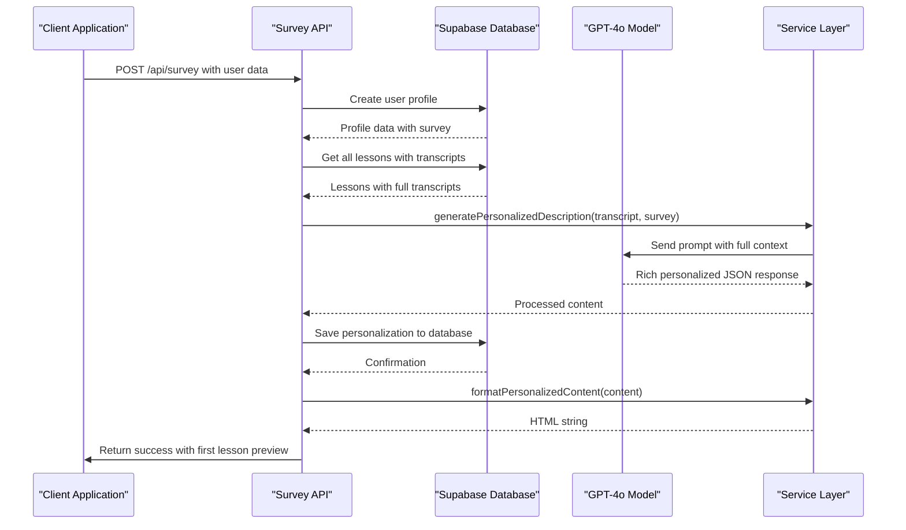
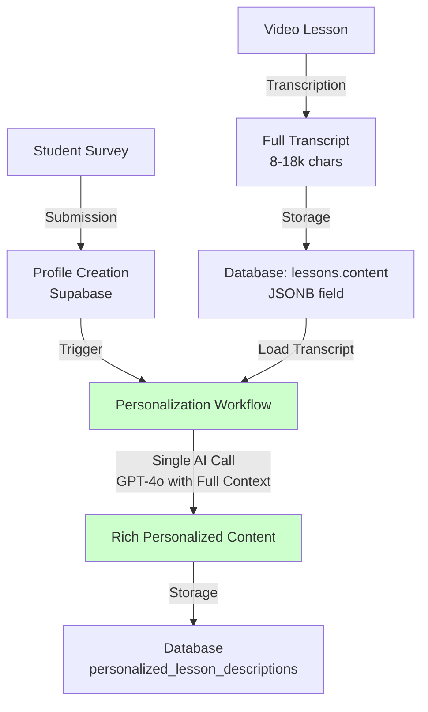
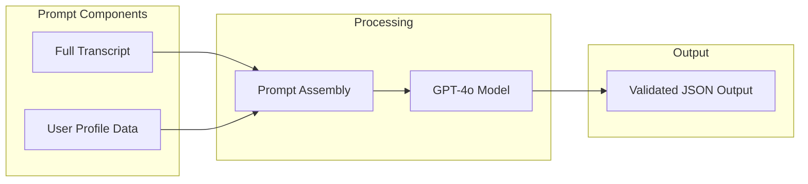
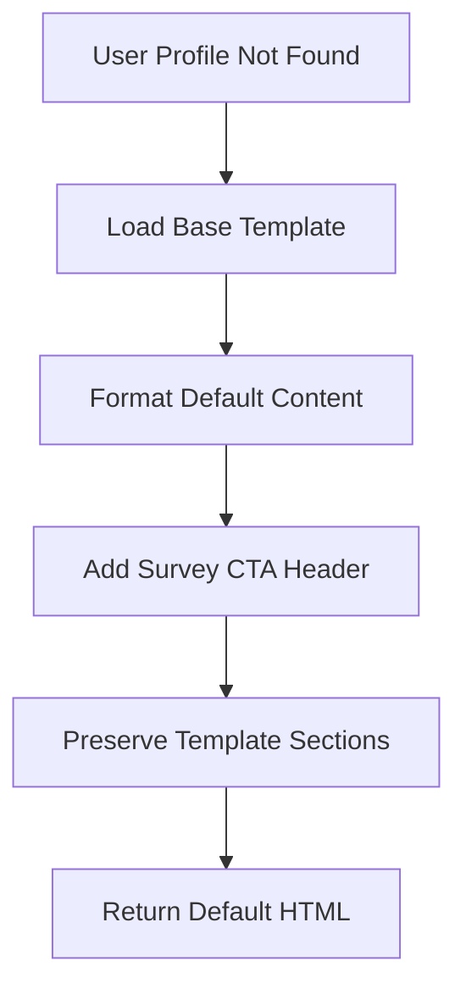
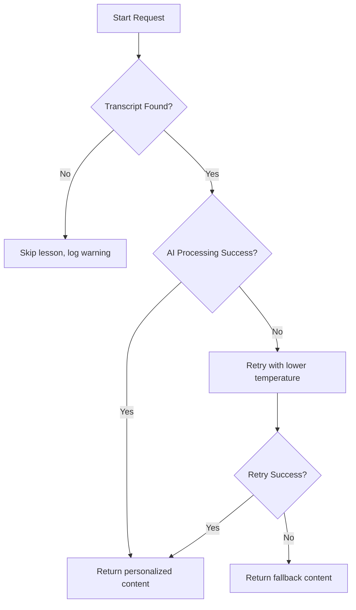

# Personalization Engine

<cite>
**Referenced Files in This Document**   
- [personalization-engine.ts](file://lib/services/personalization-engine.ts) - *Replaced template-based engine with transcript-driven generation in commit d0cc268*
- [survey/route.ts](file://app/api/survey/route.ts) - *Updated to use new personalization engine in commit d0cc268*
- [lesson-templates.ts](file://lib/services/lesson-templates.ts) - *Deprecated in favor of database transcript storage in commit d0cc268*
- [openai.ts](file://lib/services/openai.ts) - *Legacy personalization functions deprecated in commit d0cc268*
- [html-formatter.ts](file://lib/services/html-formatter.ts) - *Updated to support new content structure in commit d0cc268*
- [personalize-template/route.ts](file://app/api/persona/personalize-template/route.ts) - *Legacy endpoint using deprecated template system*
</cite>

## Update Summary
**Changes Made**   
- Completely refactored the personalization engine architecture from template-based to transcript-driven generation
- Replaced legacy `lesson-templates.ts` file system templates with database-stored transcripts
- Upgraded from GPT-4o-mini to GPT-4o for enhanced long-context processing
- Introduced new 7-section content structure for richer personalization
- Updated API endpoints to use the new personalization engine
- Deprecated legacy template loading and personalization functions
- Enhanced prompt engineering with full transcript and survey context
- Updated content formatting to support new structure

## Table of Contents
1. [Introduction](#introduction)
2. [Workflow Overview](#workflow-overview)
3. [Transcript-Based Architecture](#transcript-based-architecture)
4. [AI Prompt Engineering](#ai-prompt-engineering)
5. [Content Formatting Logic](#content-formatting-logic)
6. [Default Template Rendering](#default-template-rendering)
7. [Performance Considerations](#performance-considerations)
8. [Error Handling and Fallbacks](#error-handling-and-fallbacks)
9. [API Integration](#api-integration)
10. [Examples and Usage](#examples-and-usage)
11. [Customization Guide](#customization-guide)

## Introduction
The AI-powered personalization engine has undergone a fundamental architectural transformation, replacing the legacy template-based system with a direct transcript-driven generation approach. This new architecture eliminates the information bottleneck of the previous system by processing full lesson transcripts (8,000-18,000 characters) directly with GPT-4o, rather than working with compressed JSON templates. The engine now generates richer, more contextually relevant personalized content by analyzing complete lesson material against detailed user profiles in a single AI call, significantly improving content quality and student engagement.

**Section sources**
- [personalization-engine.ts](file://lib/services/personalization-engine.ts#L1-L30)

## Workflow Overview
The personalization engine follows a streamlined five-step process to generate deeply personalized content:

1. **Receive personalization request**: Accepts user profile data via API
2. **Load lesson transcript**: Retrieves full lesson transcript from database
3. **Retrieve user profile**: Fetches user data from Supabase database
4. **Send context to AI model**: Uses `generatePersonalizedDescription` to combine transcript and profile data for GPT-4o processing
5. **Process AI response**: Parses and validates generated JSON content with fallback mechanisms
6. **Generate HTML output**: Formats personalized content using `formatPersonalizedContent`



**Diagram sources**
- [survey/route.ts](file://app/api/survey/route.ts#L45-L170)
- [personalization-engine.ts](file://lib/services/personalization-engine.ts#L267-L370)

**Section sources**
- [survey/route.ts](file://app/api/survey/route.ts#L45-L170)

## Transcript-Based Architecture
The engine has been completely redesigned to eliminate the intermediate template generation stage. Instead of the previous three-stage process (transcription → template → personalization), the new architecture implements direct generation from full lesson transcripts.

The system now stores complete lesson transcripts in the database within the `lessons.content` JSONB field, with the following structure:
```json
{
  "transcription": "Full lesson transcript text...",
  "transcription_length": 12453,
  "transcription_source": "whisper-api",
  "transcription_date": "2024-10-08"
}
```

This approach provides several advantages:
- **Eliminates information loss**: The AI model processes full transcripts instead of compressed summaries
- **Single AI call**: Combines transcript analysis and personalization in one step
- **Richer context**: GPT-4o can analyze specific techniques, examples, and learning moments from the full lesson
- **Deeper personalization**: Enables semantic matching between lesson content and student profiles

The legacy template loading system has been deprecated, and the `loadLessonTemplate` function in `lesson-templates.ts` is now marked for removal.



**Diagram sources**
- [personalization-engine.ts](file://lib/services/personalization-engine.ts#L104-L196)
- [survey/route.ts](file://app/api/survey/route.ts#L100-L120)

**Section sources**
- [personalization-engine.ts](file://lib/services/personalization-engine.ts#L63-L93)
- [survey/route.ts](file://app/api/survey/route.ts#L100-L120)

## AI Prompt Engineering
The personalization engine employs an advanced prompt engineering approach that leverages the full context of lesson transcripts and user profiles. The prompt is designed to guide GPT-4o in creating deeply personalized lesson content with concrete references to both the lesson material and student context.

Key elements of the prompt include:
- **Role specification**: "You are an experienced course methodologist and copywriter"
- **Input context**: Complete lesson transcript (8-18k characters) and user survey data
- **Personalization requirements**: Seven specific adaptation criteria with concrete examples
- **Output format**: Strict JSON structure with defined fields
- **Response constraints**: Valid JSON only, no additional text

The prompt incorporates user-specific data points:
- Name (for personal addressing)
- Motivation and goals
- Target clients
- Desired skills
- Fears and concerns
- Expected results
- Practice model

The new prompt structure emphasizes concrete references to lesson content, requiring the AI to:
- Analyze specific techniques and examples from the transcript
- Map content to the student's fears and goals
- Create actionable homework tailored to their practice environment
- Avoid generic platitudes in favor of specific, contextual advice



**Diagram sources**
- [personalization-engine.ts](file://lib/services/personalization-engine.ts#L104-L196)

**Section sources**
- [personalization-engine.ts](file://lib/services/personalization-engine.ts#L104-L196)

## Content Formatting Logic
The engine transforms AI-generated JSON content into structured HTML for frontend display using the `formatPersonalizedContent` service. The formatting function supports multiple content formats for backward compatibility while primarily handling the new 7-section structure.

The new content structure includes:
- **introduction**: 2-3 sentences with personal addressing
- **why_it_matters_for_you**: 4-5 sentences connecting lesson content to student goals
- **key_takeaways**: 3-4 specific learning outcomes from the transcript
- **practical_application**: 3-4 sentences on applying techniques to the student's practice model
- **addressing_fears**: 2-3 sentences directly addressing the student's concerns
- **personalized_homework**: 2-4 sentences with tailored assignments
- **motivational_quote**: 1 inspirational sentence

The service detects the content format (old, new, or alternative) and transforms it appropriately before generating HTML. Each section is wrapped in appropriate CSS classes for styling, with conditional rendering ensuring only available content is displayed.

**Section sources**
- [html-formatter.ts](file://lib/services/html-formatter.ts#L22-L143)

## Default Template Rendering
When a user profile is not found, the engine serves a default template with a call-to-action to complete the survey. This functionality is implemented through the `formatDefaultTemplateContent` function in the HTML formatter service.

The default template rendering process:
1. Load the base lesson template using `loadLessonTemplate`
2. Format the template content with `formatDefaultTemplateContent`
3. Include a prominent survey CTA section with direct link
4. Return HTML with default styling and educational content

The default template preserves all educational content from the base template while adding a header section that explains the benefits of personalization and provides a direct link to the survey form. This ensures users receive valuable lesson content while being encouraged to complete their profile for full personalization.



**Diagram sources**
- [html-formatter.ts](file://lib/services/html-formatter.ts#L198-L278)
- [personalize-template/route.ts](file://app/api/persona/personalize-template/route.ts#L80-L90)

**Section sources**
- [html-formatter.ts](file://lib/services/html-formatter.ts#L198-L278)
- [personalize-template/route.ts](file://app/api/persona/personalize-template/route.ts#L80-L90)

## Performance Considerations
The personalization engine incorporates several performance optimization strategies:

### Service Layer Efficiency
The modular service architecture improves performance by:
- Encapsulating reusable logic in dedicated services
- Reducing code duplication across endpoints
- Enabling easier optimization of individual components

### Processing Optimization
- Transcripts are loaded directly from the database rather than file system
- User profile and lesson data are retrieved in single database queries
- AI processing occurs with complete context in a single call
- Service functions include error handling to prevent cascading failures

### Cost Management
- Upgraded to GPT-4o for better long-context understanding
- Implemented retry logic with adjusted temperature to improve success rate
- Monitored token usage to balance quality and cost

**Section sources**
- [personalization-engine.ts](file://lib/services/personalization-engine.ts#L267-L370)

## Error Handling and Fallbacks
The engine implements comprehensive error handling and fallback mechanisms:

### AI Processing Failure
If the OpenAI API call fails, the system implements a two-tier fallback:
1. Retry once with lower temperature (0.5)
2. If retry fails, return fallback content with basic personalization

### Transcript Not Found
When no transcript is available in the database:
- Log warning and skip personalization for that lesson
- Continue processing remaining lessons
- Return partial success response

### Survey Data Missing
For incomplete survey submissions:
- Use available data for personalization
- Fill missing fields with generic but relevant content
- Prioritize core personalization elements



**Diagram sources**
- [personalization-engine.ts](file://lib/services/personalization-engine.ts#L300-L370)

**Section sources**
- [personalization-engine.ts](file://lib/services/personalization-engine.ts#L300-L370)

## API Integration
The personalization engine exposes RESTful API endpoints and integrates with external services:

### Main Endpoint
**POST** `/api/survey`

Request body:
```json
{
  "real_name": "string",
  "course": "string",
  "motivation": ["career change", "help others"],
  "target_clients": "office workers",
  "skills_wanted": "pain relief techniques",
  "fears": ["hurting clients"],
  "wow_result": "become confident therapist",
  "practice_model": "friend with back pain",
  "uid": "string (optional)"
}
```

Response:
```json
{
  "success": "boolean",
  "profileId": "string",
  "userIdentifier": "string",
  "message": "string",
  "firstLessonPreview": {
    "html": "string",
    "lessonNumber": "number",
    "lessonTitle": "string"
  }
}
```

### External Service Integration
- **Supabase**: Used for user profile and lesson data storage/retrieval
- **OpenAI**: GPT-4o model for content personalization
- **Database**: Transcript storage and retrieval
- **Service Layer**: Modular components for transcript loading, personalization, formatting, and database operations

**Section sources**
- [survey/route.ts](file://app/api/survey/route.ts#L1-L170)
- [personalization-engine.ts](file://lib/services/personalization-engine.ts#L267-L370)

## Examples and Usage
### Input Transcript Example
```json
{
  "transcription": "In this lesson, we'll cover the fundamentals of Swedish massage techniques. Start with effleurage using the palmar surface of your hands, applying light to medium pressure in long, flowing strokes. Focus on the back muscles, particularly the trapezius and latissimus dorsi. Use your thumbs for deeper pressure on trigger points, but always check in with your client about comfort levels...",
  "transcription_length": 12453,
  "transcription_source": "whisper-api"
}
```

### User Profile Data
```json
{
  "real_name": "Alexey",
  "survey": {
    "motivation": ["career change", "help others"],
    "target_clients": "office workers",
    "skills_wanted": "pain relief techniques",
    "fears": ["hurting clients"],
    "wow_result": "become confident therapist",
    "practice_model": "friend with back pain"
  }
}
```

### Output Personalization
The AI generates a JSON response that is formatted into HTML containing personalized sections addressing the user's specific context, goals, and concerns, with concrete references to techniques from the lesson transcript.

**Section sources**
- [personalization-engine.ts](file://lib/services/personalization-engine.ts#L267-L370)
- [html-formatter.ts](file://lib/services/html-formatter.ts#L22-L143)

## Customization Guide
### Modifying AI Prompts
To modify the AI prompts for different content styles, edit the `createPersonalizationPrompt` function in `personalization-engine.ts`. Key areas for customization:

1. **Role specification**: Change the instructor persona
2. **Personalization requirements**: Modify the seven adaptation criteria
3. **Output structure**: Add or remove JSON fields
4. **Tone and style**: Adjust language formality and approach

### Adding New Template Fields
To support additional content fields:
1. Update the prompt's output format specification
2. Modify the `formatPersonalizedContent` function to include new HTML sections
3. Update any dependent frontend components

### Performance Tuning
- Adjust `temperature` parameter (currently 0.7) for more/less creative outputs
- Modify `max_tokens` limit (currently 2500) based on content length requirements
- Implement additional caching layers as needed

**Section sources**
- [personalization-engine.ts](file://lib/services/personalization-engine.ts#L104-L196)
- [html-formatter.ts](file://lib/services/html-formatter.ts#L22-L143)