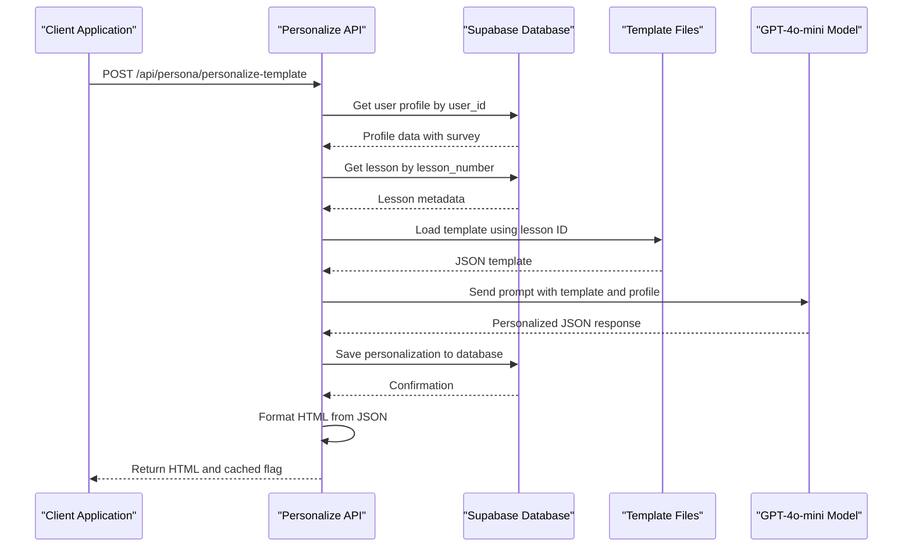
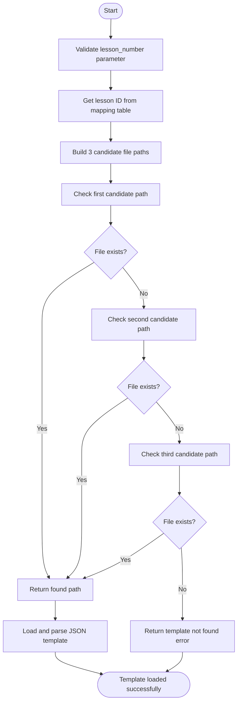
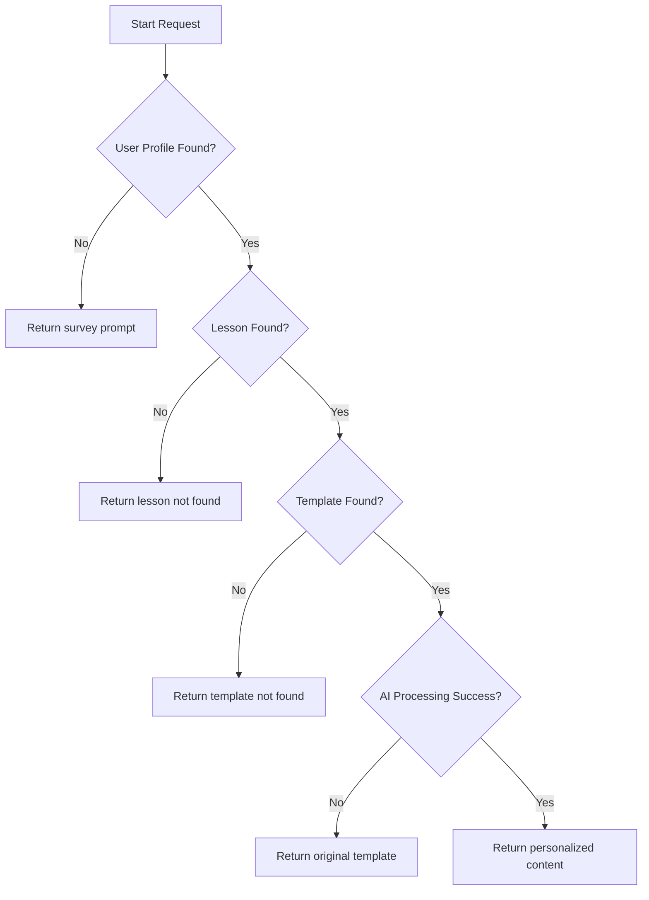

# Personalization Engine

<cite>
**Referenced Files in This Document**   
- [personalize-template/route.ts](file://app/api/persona/personalize-template/route.ts)
- [openai.ts](file://lib/openai.ts)
- [server.ts](file://lib/supabase/server.ts)
- [personalizations/route.ts](file://app/api/personalizations/route.ts)
- [lesson.json](file://store/shvz/lessons/01/lesson.json)
</cite>

## Table of Contents
1. [Introduction](#introduction)
2. [Workflow Overview](#workflow-overview)
3. [Template Loading Strategy](#template-loading-strategy)
4. [AI Prompt Engineering](#ai-prompt-engineering)
5. [Content Formatting Logic](#content-formatting-logic)
6. [Performance Considerations](#performance-considerations)
7. [Error Handling and Fallbacks](#error-handling-and-fallbacks)
8. [API Integration](#api-integration)
9. [Examples and Usage](#examples-and-usage)
10. [Customization Guide](#customization-guide)

## Introduction
The AI-powered personalization engine is the core component of the persona application, responsible for delivering customized lesson content based on user profiles. This system integrates multiple services including Supabase for data storage, OpenAI's GPT-4o-mini for content generation, and a file-based template system to create personalized learning experiences.

**Section sources**
- [personalize-template/route.ts](file://app/api/persona/personalize-template/route.ts#L1-L45)

## Workflow Overview
The personalization engine follows a six-step process to generate customized content:

1. **Receive personalization request**: Accepts user ID and lesson number via API
2. **Load base JSON template**: Retrieves lesson template from file system
3. **Retrieve user profile**: Fetches user data from Supabase database
4. **Send context to AI model**: Combines template and profile data for GPT-4o-mini processing
5. **Process AI response**: Parses and validates generated JSON content
6. **Generate HTML output**: Formats personalized content for frontend display



**Diagram sources**
- [personalize-template/route.ts](file://app/api/persona/personalize-template/route.ts#L45-L128)
- [server.ts](file://lib/supabase/server.ts#L1-L28)

**Section sources**
- [personalize-template/route.ts](file://app/api/persona/personalize-template/route.ts#L45-L128)

## Template Loading Strategy
The engine implements a robust template loading mechanism with lesson ID mapping and fallback capabilities. Templates are stored in the `store/shvz` directory with a naming convention that supports multiple formats.

The system uses a lesson number to ID mapping function to locate the correct template file. Three candidate filename patterns are checked in order:
1. `{lesson_number}-{lesson_number}-{id}-final.json`
2. `{lesson_number}-{id}-final.json` 
3. `{id}-final.json`

This hierarchical approach ensures backward compatibility while supporting the current naming convention. The lesson ID mapping is maintained in a lookup table within the `getLessonId` function.



**Diagram sources**
- [personalize-template/route.ts](file://app/api/persona/personalize-template/route.ts#L84-L104)

**Section sources**
- [personalize-template/route.ts](file://app/api/persona/personalize-template/route.ts#L84-L104)
- [personalize-template/route.ts](file://app/api/persona/personalize-template/route.ts#L151-L167)

## AI Prompt Engineering
The personalization engine employs a structured prompt engineering approach to ensure consistent and relevant AI-generated content. The prompt template is designed to guide GPT-4o-mini in creating personalized lesson content based on user profile data.

Key elements of the prompt include:
- **Role specification**: "You are an experienced massage instructor named Anastasia Fomina"
- **Input context**: Complete lesson template and user survey data
- **Personalization requirements**: Five specific adaptation criteria
- **Output format**: Strict JSON structure with defined fields
- **Response constraints**: Valid JSON only, no additional text

The prompt incorporates user-specific data points:
- Name (for personal addressing)
- Motivation and goals
- Target clients
- Desired skills
- Fears and concerns
- Expected results
- Practice model


**Diagram sources**
- [personalize-template/route.ts](file://app/api/persona/personalize-template/route.ts#L172-L230)

**Section sources**
- [personalize-template/route.ts](file://app/api/persona/personalize-template/route.ts#L172-L230)

## Content Formatting Logic
The engine transforms AI-generated JSON content into structured HTML for frontend display. The formatting function checks for the presence of each content field and conditionally includes corresponding HTML sections.

The generated HTML includes:
- **Summary section**: Brief lesson overview
- **Previous lessons**: Content if available
- **Why watch**: Motivational content based on user goals
- **Quick action**: Immediate actionable item
- **Homework**: 20-minute assignment adapted to practice model
- **Social sharing**: Content for social media sharing

Each section is wrapped in appropriate CSS classes for styling, with conditional rendering ensuring only available content is displayed. The output is wrapped in a "persona-block" container for consistent presentation.

**Section sources**
- [personalize-template/route.ts](file://app/api/persona/personalize-template/route.ts#L235-L281)

## Performance Considerations
The personalization engine incorporates several performance optimization strategies:

### Caching Mechanism
The system implements response caching through the `flush` parameter. When `flush` is false (default), the `cached: true` flag is returned in the response, indicating that cached content was served. This reduces unnecessary AI processing for repeat requests.

### Rate Limiting
While not explicitly implemented in the code, the architecture supports rate limiting through:
- Supabase query optimization
- File system caching of templates
- Conditional AI processing

### Processing Optimization
- Template files are loaded directly from the file system rather than through database queries
- User profile and lesson data are retrieved in single database queries
- AI processing only occurs when both user profile and template are available

**Section sources**
- [personalize-template/route.ts](file://app/api/persona/personalize-template/route.ts#L126-L128)

## Error Handling and Fallbacks
The engine implements comprehensive error handling and fallback mechanisms:

### User Profile Not Found
When a user profile is not found, the system returns a fallback HTML message prompting the user to complete their survey, including a direct link to the survey form with their user ID.

### Lesson Not Found
If the requested lesson number doesn't exist in the database, an error message is returned indicating the lesson was not found.

### Template Not Found
When no template file matches the lesson ID candidates, an error message is returned indicating the template is missing.

### AI Processing Failure
If the OpenAI API call fails, the system gracefully falls back to returning the original template content rather than failing completely.



**Diagram sources**
- [personalize-template/route.ts](file://app/api/persona/personalize-template/route.ts#L60-L84)

**Section sources**
- [personalize-template/route.ts](file://app/api/persona/personalize-template/route.ts#L60-L84)

## API Integration
The personalization engine exposes a RESTful API endpoint and integrates with external services:

### Main Endpoint
**POST** `/api/persona/personalize-template`

Request body:
```json
{
  "user_id": "string",
  "lesson_number": "number",
  "flush": "boolean (optional)"
}
```

Response:
```json
{
  "ok": "boolean",
  "html": "string",
  "cached": "boolean"
}
```

### External Service Integration
- **Supabase**: Used for user profile and lesson data storage/retrieval
- **OpenAI**: GPT-4o-mini model for content personalization
- **File System**: Template storage and retrieval

**Section sources**
- [personalize-template/route.ts](file://app/api/persona/personalize-template/route.ts#L1-L45)
- [personalizations/route.ts](file://app/api/personalizations/route.ts#L1-L134)

## Examples and Usage
### Input Template Example
```json
{
  "number": 1,
  "title": "Урок введение.",
  "description": "Урок введение.",
  "duration": "6 минут",
  "status": "active",
  "created_at": "2024-10-08"
}
```

### User Profile Data
```json
{
  "name": "Alexey",
  "survey": {
    "motivation": ["career change", "help others"],
    "target_clients": "office workers",
    "skills_wanted": "pain relief techniques",
    "fears": ["hurting clients"],
    "wow_result": "become confident therapist",
    "practice_model": "friend with back pain"
  }
}
```

### Output Personalization
The AI generates a JSON response that is formatted into HTML containing personalized sections addressing the user's specific context, goals, and concerns.

**Section sources**
- [lesson.json](file://store/shvz/lessons/01/lesson.json#L1-L8)
- [personalize-template/route.ts](file://app/api/persona/personalize-template/route.ts#L172-L230)

## Customization Guide
### Modifying AI Prompts
To modify the AI prompts for different content styles, edit the prompt string in the `personalizeTemplate` function. Key areas for customization:

1. **Role specification**: Change the instructor persona
2. **Personalization requirements**: Modify the five adaptation criteria
3. **Output structure**: Add or remove JSON fields
4. **Tone and style**: Adjust language formality and approach

### Adding New Template Fields
To support additional content fields:
1. Update the prompt's output format specification
2. Modify the `formatPersonalizedContent` function to include new HTML sections
3. Update any dependent frontend components

### Performance Tuning
- Adjust `temperature` parameter (currently 0.7) for more/less creative outputs
- Modify `max_tokens` limit (currently 1000) based on content length requirements
- Implement additional caching layers as needed

**Section sources**
- [personalize-template/route.ts](file://app/api/persona/personalize-template/route.ts#L172-L230)
- [personalize-template/route.ts](file://app/api/persona/personalize-template/route.ts#L235-L281)