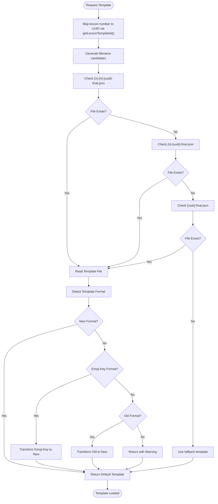
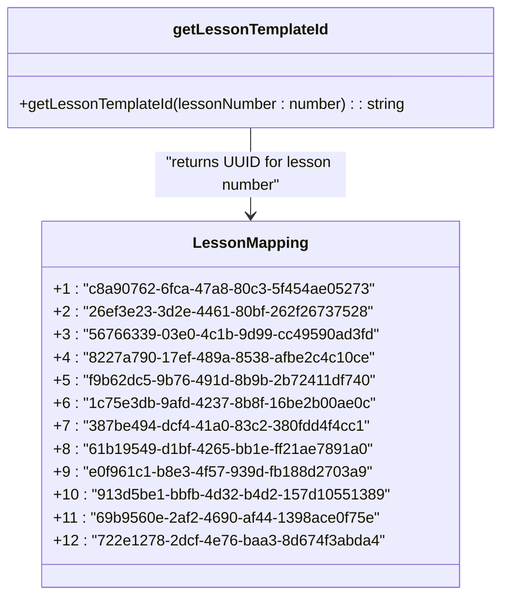
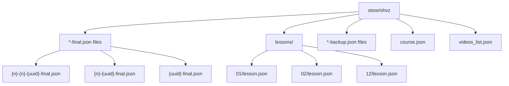
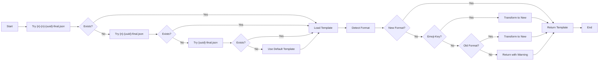
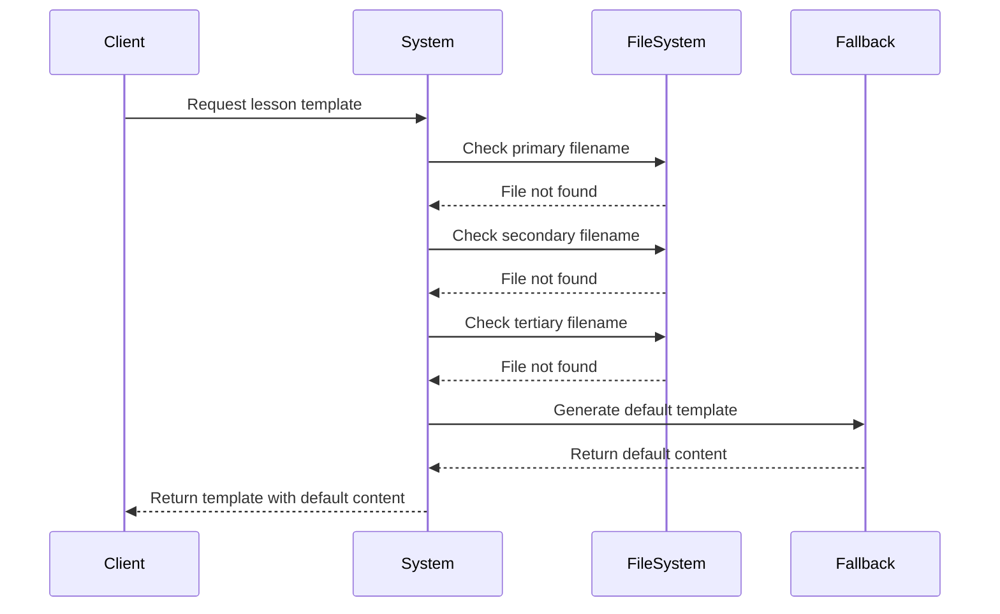

# Template Loading Strategy

<cite>
**Referenced Files in This Document**   
- [route.ts](file://app/api/survey/route.ts)
- [route.ts](file://app/api/persona/personalize-template/route.ts)
- [regenerate-lesson-templates.ts](file://scripts/regenerate-lesson-templates.ts)
- [page.tsx](file://app/(dashboard)/dashboard/templates/page.tsx)
- [lesson-templates.ts](file://lib/services/lesson-templates.ts) - *Updated with emoji-key format support*
- [store/shvz](file://store/shvz)
</cite>

## Update Summary
**Changes Made**   
- Added documentation for emoji-key template format support
- Updated template structure section to reflect new 7-section format
- Enhanced fallback chain explanation to include format transformation
- Added examples of emoji-key format templates
- Updated lesson ID mapping system to reference centralized implementation
- Added validation details for new template format

## Table of Contents
1. [Introduction](#introduction)
2. [Template Resolution Mechanism](#template-resolution-mechanism)
3. [Lesson ID Mapping System](#lesson-id-mapping-system)
4. [File System Structure](#file-system-structure)
5. [Fallback Chain for Template Loading](#fallback-chain-for-template-loading)
6. [Template Structure and Format](#template-structure-and-format)
7. [Adding New Templates](#adding-new-templates)
8. [Error Handling and Graceful Degradation](#error-handling-and-graceful-degradation)
9. [Maintenance and Backward Compatibility](#maintenance-and-backward-compatibility)

## Introduction
The personalization engine relies on a robust template loading mechanism that serves as the foundation for AI-driven content personalization. This document details how lesson templates are resolved from the file system using the `getLessonTemplateId` function and standardized filename patterns. The file system acts as the source of truth for lesson templates before any AI personalization occurs. The system implements a sophisticated fallback chain to ensure template availability and uses stable UUIDs mapped to lesson numbers for consistent template resolution. Recent updates have added support for emoji-key template formats, expanding the system's flexibility in handling different template structures.

## Template Resolution Mechanism
The template loading system resolves lesson templates through a combination of lesson number mapping and filename pattern matching. When a lesson needs to be personalized, the system first determines the correct template file by mapping the lesson number to its corresponding UUID using the `getLessonTemplateId` function. This function provides a stable identifier that remains consistent across different environments and deployments.

The template resolution occurs primarily in the `loadLessonTemplate` function within the lesson-templates service. The system constructs candidate filenames using the lesson number and resolved UUID, then attempts to locate the template file in the designated store directory. Once found, the system detects the template format and transforms it to the standard structure if necessary.



**Diagram sources**
- [lesson-templates.ts](file://lib/services/lesson-templates.ts#L63-L120)
- [route.ts](file://app/api/survey/route.ts#L200-L208)
- [route.ts](file://app/api/persona/personalize-template/route.ts#L86-L92)

**Section sources**
- [lesson-templates.ts](file://lib/services/lesson-templates.ts#L63-L120)
- [route.ts](file://app/api/survey/route.ts#L151-L208)
- [route.ts](file://app/api/persona/personalize-template/route.ts#L86-L92)

## Lesson ID Mapping System
The system uses a stable mapping between lesson numbers (1-12) and UUIDs to ensure consistent template resolution across different components and deployments. This mapping is implemented in the `getLessonTemplateId` function within the lesson-templates service, which serves as the single source of truth for lesson ID mappings.

The mapping table provides a one-to-one correspondence between sequential lesson numbers and unique UUIDs, enabling the system to maintain backward compatibility while allowing for flexible filename patterns. This approach decouples the logical lesson numbering from the physical file storage, allowing for organizational flexibility in the file system.



**Diagram sources**
- [lesson-templates.ts](file://lib/services/lesson-templates.ts#L47-L49)
- [regenerate-lesson-templates.ts](file://scripts/regenerate-lesson-templates.ts#L198-L214)

**Section sources**
- [lesson-templates.ts](file://lib/services/lesson-templates.ts#L47-L49)
- [lesson-templates.ts](file://lib/services/lesson-templates.ts#L54-L56)
- [regenerate-lesson-templates.ts](file://scripts/regenerate-lesson-templates.ts#L198-L214)

## File System Structure
The lesson templates are stored in the `store/shvz` directory, which serves as the central repository for all template files. The system supports multiple filename patterns to accommodate different organizational approaches and migration scenarios. The primary storage location contains both current templates and backup versions for version control and recovery purposes.

The directory structure includes both the final template files and source materials such as individual lesson JSON files in the `lessons` subdirectory. This organization allows for template regeneration from source materials when needed, providing a complete workflow for template maintenance and updates.



**Diagram sources**
- [store/shvz](file://store/shvz)
- [page.tsx](file://app/(dashboard)/dashboard/templates/page.tsx#L10-L12)

**Section sources**
- [store/shvz](file://store/shvz)
- [page.tsx](file://app/(dashboard)/dashboard/templates/page.tsx#L10-L12)

## Fallback Chain for Template Loading
The template loading system implements a three-tier fallback chain to ensure template availability even when files are missing or misnamed. When resolving a template, the system attempts to locate the file using three different filename patterns in sequence:

1. `{lesson_number}-{lesson_number}-{uuid}-final.json` - The most specific pattern including both lesson number and UUID
2. `{lesson_number}-{uuid}-final.json` - A simplified pattern with lesson number and UUID
3. `{uuid}-final.json` - The minimal pattern using only the UUID

This fallback mechanism provides backward compatibility with different naming conventions used during system evolution. If none of the patterns yield an existing file, the system can fall back to a basic template structure with default content, ensuring that personalization can proceed even with missing template files.

Additionally, the system implements a format transformation fallback chain:
1. If the template is already in the new 7-section format, return it as-is
2. If the template uses emoji-key format, transform it to the new format using `transformEmojiToNew`
3. If the template uses the old 5-field format, transform it to the new format using `transformOldToNew`
4. If the format is unknown, return the template with a warning



**Diagram sources**
- [lesson-templates.ts](file://lib/services/lesson-templates.ts#L63-L120)
- [route.ts](file://app/api/survey/route.ts#L202-L206)
- [route.ts](file://app/api/persona/personalize-template/route.ts#L88-L90)

**Section sources**
- [lesson-templates.ts](file://lib/services/lesson-templates.ts#L63-L120)
- [route.ts](file://app/api/survey/route.ts#L202-L208)
- [route.ts](file://app/api/persona/personalize-template/route.ts#L88-L92)

## Template Structure and Format
Lesson templates are stored as JSON files with a standardized structure that includes key educational components. The system now supports three template formats:

1. **New 7-section format**: The current standard format with fields like `introduction`, `key_points`, `practical_tips`, etc.
2. **Emoji-key format**: A transitional format using emoji-prefixed keys like `👋 Введение`, `🔑 Ключевые моменты`
3. **Legacy 5-field format**: The original format with fields like `summary_short`, `why_watch`, `homework_20m`

The template structure is designed to support the personalization workflow, with each field serving a specific pedagogical purpose. The system reads these templates from the file system and passes them to the AI personalization engine, which adapts the content based on user survey responses and profile information.

### New 7-Section Template Structure
```json
{
  "introduction": "2-3 sentences: lesson goal and expected result",
  "key_points": ["4-6 bullet points, each ≤18 words"],
  "practical_tips": ["3-5 instruction points with imperative verbs"],
  "important_notes": ["2-4 points about contraindications (conditional)"],
  "equipment_preparation": "Equipment list and setup (conditional)",
  "homework": "1-2 sentences with concrete action",
  "motivational_line": "1 inspirational sentence"
}
```

### Emoji-Key Template Format Example
```json
{
    "👋 Введение": "Урок 4 посвящен изучению триггерных точек и их проработке для улучшения состояния мышц.",
    "🔑 Ключевые моменты": [
        "Научитесь находить и прорабатывать триггерные точки в различных мышцах.",
        "Узнаете методы разминания малых и больших грудных мышц.",
        "Поймете, как выполнять ишемическую компрессию для расслабления мышц.",
        "Научитесь работать с неповерхностными мышцами, такими как трапециевидная и ременные мышцы."
    ],
    "💡 Практические советы": [
        "Избегайте давления на переднюю поверхность шеи и еремную вырезку.",
        "Следите за состоянием клиента во время и после массажа.",
        "Проверяйте болевые ощущения клиента, используя шкалу от 0 до 10."
    ],
    "🧰 Инвентарь и подготовка": "Массажный стол, масло или крем, маленькое полотенце, 30 минут, модель лежит на спине.",
    "📚 Домашнее задание": "Практикуйте проработку триггерных точек на себе в свободное время, уделяя внимание зонам напряжения.",
    "_мотивационная строка_": "*Продолжайте развивать свои навыки, чтобы улучшать здоровье и самочувствие клиентов.*"
}
```

The system automatically detects the template format using the `detectTemplateFormat` function and transforms it to the standard 7-section structure when necessary.

```mermaid
erDiagram
TEMPLATE {
string introduction
string[] key_points
string[] practical_tips
string[] important_notes
string equipment_preparation
string homework
string motivational_line
}
EMOJI_TEMPLATE {
string "👋 Введение"
string[] "🔑 Ключевые моменты"
string[] "💡 Практические советы"
string "🧰 Инвентарь и подготовка"
string "📚 Домашнее задание"
string "_мотивационная строка_"
}
LEGACY_TEMPLATE {
string summary_short
string why_watch
string quick_action
string social_share
string homework_20m
}
TEMPLATE ||--o{ EMOJI_TEMPLATE : "transformed from"
TEMPLATE ||--o{ LEGACY_TEMPLATE : "transformed from"
```

**Diagram sources**
- [lesson-templates.ts](file://lib/services/lesson-templates.ts#L147-L174)
- [lesson-templates.ts](file://lib/services/lesson-templates.ts#L212-L222)
- [store/shvz/3-56766339-03e0-4c1b-9d99-cc49590ad3fd-final.json)
- [store/shvz/1-c8a90762-6fca-47a8-80c3-5f454ae05273-final.json)

**Section sources**
- [lesson-templates.ts](file://lib/services/lesson-templates.ts#L147-L174)
- [lesson-templates.ts](file://lib/services/lesson-templates.ts#L212-L222)
- [store/shvz/3-56766339-03e0-4c1b-9d99-cc49590ad3fd-final.json)
- [store/shvz/1-c8a90762-6fca-47a8-80c3-5f454ae05273-final.json)

## Adding New Templates
To add new templates to the system, follow these steps:

1. Create a new JSON file in the `store/shvz` directory using one of the supported naming patterns
2. Ensure the filename includes the correct lesson number and corresponding UUID from the mapping table
3. Populate the template with the required fields for the new 7-section format: `introduction`, `key_points`, `practical_tips`, `homework`, and `motivational_line`
4. Validate the JSON structure and syntax before deployment

The system provides a regeneration script (`regenerate-lesson-templates.ts`) that can automatically generate new templates from source materials. This script reads lesson information from the `lessons` subdirectory and uses AI to create updated template content, ensuring consistency across all lessons.

When adding templates for new lesson numbers beyond the current range (1-12), the `LESSON_ID_MAP` in `lesson-templates.ts` must be updated to include the new mapping. This ensures that the template resolution system can properly locate and load the new templates.

For backward compatibility, templates can also be created in the emoji-key format or legacy format, but they will be automatically transformed to the new standard format when loaded.

**Section sources**
- [regenerate-lesson-templates.ts](file://scripts/regenerate-lesson-templates.ts)
- [lesson-templates.ts](file://lib/services/lesson-templates.ts#L212-L222)
- [store/shvz](file://store/shvz)

## Error Handling and Graceful Degradation
The template loading system implements comprehensive error handling to ensure graceful degradation when issues occur. When a template file cannot be found or loaded, the system provides fallback content rather than failing completely. This approach ensures that the personalization workflow can continue even with missing or corrupted template files.

The system handles several common error scenarios:
- Missing template files: Uses the fallback chain to attempt alternative filenames
- Invalid JSON: Catches parsing errors and logs warnings while continuing execution
- File system errors: Handles read permissions and I/O issues gracefully
- Missing lesson mappings: Returns empty string for unmapped lesson numbers
- Unknown template formats: Returns template with warning while continuing

When template loading fails, the system can fall back to a basic template structure with generic content, allowing the AI personalization process to proceed with minimal disruption. Error messages are logged for debugging purposes, but user-facing interfaces display helpful messages rather than technical errors.



**Diagram sources**
- [lesson-templates.ts](file://lib/services/lesson-templates.ts#L63-L120)
- [route.ts](file://app/api/survey/route.ts#L208-L218)
- [route.ts](file://app/api/persona/personalize-template/route.ts#L92-L100)

**Section sources**
- [lesson-templates.ts](file://lib/services/lesson-templates.ts#L63-L120)
- [route.ts](file://app/api/survey/route.ts#L208-L218)
- [route.ts](file://app/api/persona/personalize-template/route.ts#L92-L100)

## Maintenance and Backward Compatibility
The template loading system is designed with backward compatibility as a primary concern. The fallback chain and multiple filename patterns allow for smooth transitions when updating template organization or naming conventions. When modifying existing templates or adding new ones, consider the following best practices:

1. Always maintain the lesson number to UUID mapping in the centralized `LESSON_ID_MAP` in `lesson-templates.ts`
2. Use the full `{lesson_number}-{lesson_number}-{uuid}-final.json` pattern for new templates to ensure maximum compatibility
3. Create backup copies before modifying existing templates
4. Test template loading across all relevant endpoints after making changes
5. Prefer the new 7-section format for new templates, but support emoji-key and legacy formats for backward compatibility

The system's centralized approach to lesson ID mapping (in `lesson-templates.ts`) ensures consistency across all components. The `detectTemplateFormat` and transformation functions (`transformEmojiToNew`, `transformOldToNew`) provide seamless backward compatibility while allowing the system to evolve to the new standard format.

Regular maintenance should include verifying that all lesson numbers have corresponding template files and that the UUID mappings remain accurate. The dashboard template viewer provides a visual interface for monitoring template availability and identifying missing or problematic files. Additionally, the `validateNewTemplate` function can be used to ensure new templates meet the required structure and field constraints.

**Section sources**
- [lesson-templates.ts](file://lib/services/lesson-templates.ts#L47-L49)
- [lesson-templates.ts](file://lib/services/lesson-templates.ts#L147-L174)
- [lesson-templates.ts](file://lib/services/lesson-templates.ts#L212-L222)
- [regenerate-lesson-templates.ts](file://scripts/regenerate-lesson-templates.ts#L198-L214)
- [page.tsx](file://app/(dashboard)/dashboard/templates/page.tsx)