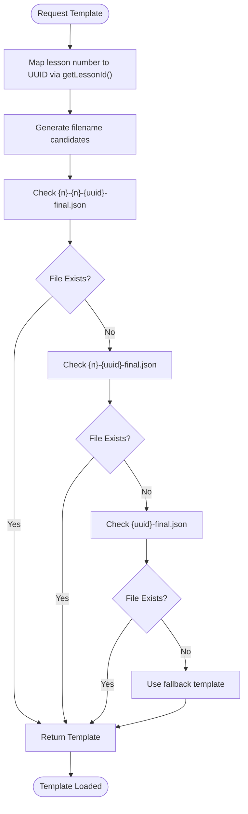
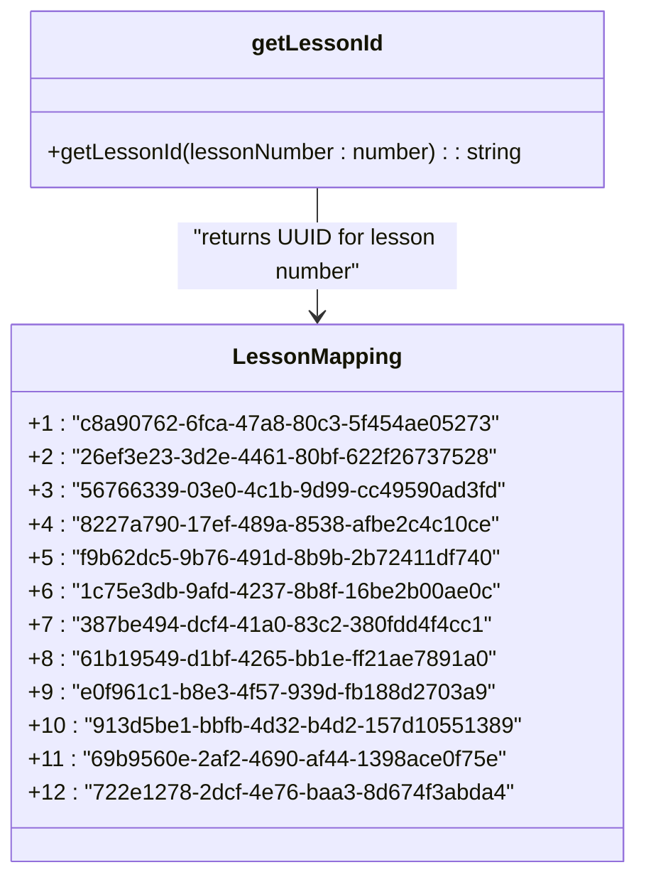
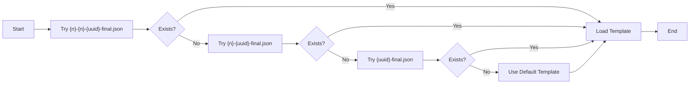
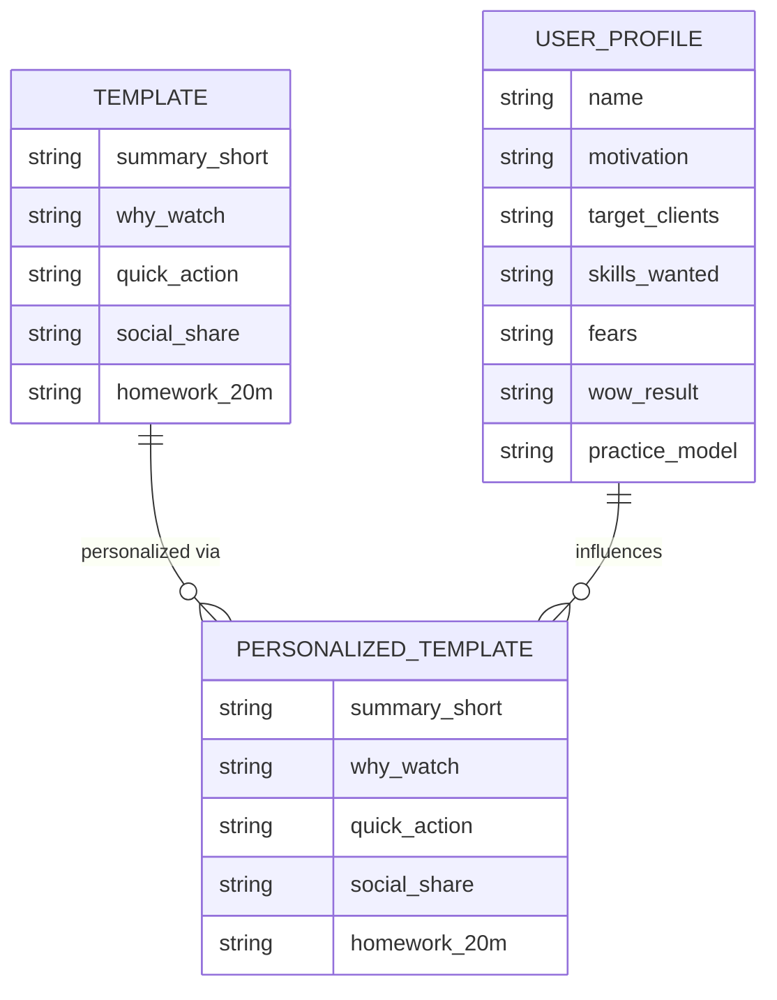

# Template Loading Strategy

<cite>
**Referenced Files in This Document**   
- [route.ts](file://app/api/survey/route.ts)
- [route.ts](file://app/api/persona/personalize-template/route.ts)
- [regenerate-lesson-templates.ts](file://scripts/regenerate-lesson-templates.ts)
- [page.tsx](file://app/(dashboard)/dashboard/templates/page.tsx)
- [store/shvz](file://store/shvz)
</cite>

## Table of Contents
1. [Introduction](#introduction)
2. [Template Resolution Mechanism](#template-resolution-mechanism)
3. [Lesson ID Mapping System](#lesson-id-mapping-system)
4. [File System Structure](#file-system-structure)
5. [Fallback Chain for Template Loading](#fallback-chain-for-template-loading)
6. [Template Structure and Format](#template-structure-and-format)
7. [Adding New Templates](#adding-new-templates)
8. [Error Handling and Graceful Degradation](#error-handling-and-graceful-degradation)
9. [Maintenance and Backward Compatibility](#maintenance-and-backward-compatibility)

## Introduction
The personalization engine relies on a robust template loading mechanism that serves as the foundation for AI-driven content personalization. This document details how lesson templates are resolved from the file system using the `getLessonId` function and standardized filename patterns. The file system acts as the source of truth for lesson templates before any AI personalization occurs. The system implements a sophisticated fallback chain to ensure template availability and uses stable UUIDs mapped to lesson numbers for consistent template resolution.

## Template Resolution Mechanism
The template loading system resolves lesson templates through a combination of lesson number mapping and filename pattern matching. When a lesson needs to be personalized, the system first determines the correct template file by mapping the lesson number to its corresponding UUID using the `getLessonId` function. This function provides a stable identifier that remains consistent across different environments and deployments.

The template resolution occurs in multiple locations throughout the codebase, primarily in the survey processing and template personalization endpoints. The system constructs candidate filenames using the lesson number and resolved UUID, then attempts to locate the template file in the designated store directory.

**Diagram sources**
- [route.ts](file://app/api/survey/route.ts#L200-L208)
- [route.ts](file://app/api/persona/personalize-template/route.ts#L86-L92)

**Section sources**
- [route.ts](file://app/api/survey/route.ts#L151-L208)
- [route.ts](file://app/api/persona/personalize-template/route.ts#L86-L92)

## Lesson ID Mapping System
The system uses a stable mapping between lesson numbers (1-12) and UUIDs to ensure consistent template resolution across different components and deployments. This mapping is implemented in the `getLessonId` function, which is duplicated across multiple files to ensure availability without requiring shared dependencies.

The mapping table provides a one-to-one correspondence between sequential lesson numbers and unique UUIDs, enabling the system to maintain backward compatibility while allowing for flexible filename patterns. This approach decouples the logical lesson numbering from the physical file storage, allowing for organizational flexibility in the file system.

**Diagram sources**
- [route.ts](file://app/api/survey/route.ts#L299-L316)
- [regenerate-lesson-templates.ts](file://scripts/regenerate-lesson-templates.ts#L195-L211)

**Section sources**
- [route.ts](file://app/api/survey/route.ts#L299-L316)
- [route.ts](file://app/api/persona/personalize-template/route.ts#L151-L167)
- [regenerate-lesson-templates.ts](file://scripts/regenerate-lesson-templates.ts#L195-L211)

## File System Structure
The lesson templates are stored in the `store/shvz` directory, which serves as the central repository for all template files. The system supports multiple filename patterns to accommodate different organizational approaches and migration scenarios. The primary storage location contains both current templates and backup versions for version control and recovery purposes.

The directory structure includes both the final template files and source materials such as individual lesson JSON files in the `lessons` subdirectory. This organization allows for template regeneration from source materials when needed, providing a complete workflow for template maintenance and updates.

**Diagram sources**
- [store/shvz](file://store/shvz)
- [page.tsx](file://app/(dashboard)/dashboard/templates/page.tsx#L10-L12)

**Section sources**
- [store/shvz](file://store/shvz)
- [page.tsx](file://app/(dashboard)/dashboard/templates/page.tsx#L10-L12)

## Fallback Chain for Template Loading
The template loading system implements a three-tier fallback chain to ensure template availability even when files are missing or misnamed. When resolving a template, the system attempts to locate the file using three different filename patterns in sequence:

1. `{lesson_number}-{lesson_number}-{uuid}-final.json` - The most specific pattern including both lesson number and UUID
2. `{lesson_number}-{uuid}-final.json` - A simplified pattern with lesson number and UUID
3. `{uuid}-final.json` - The minimal pattern using only the UUID

This fallback mechanism provides backward compatibility with different naming conventions used during system evolution. If none of the patterns yield an existing file, the system can fall back to a basic template structure with default content, ensuring that personalization can proceed even with missing template files.

**Diagram sources**
- [route.ts](file://app/api/survey/route.ts#L202-L206)
- [route.ts](file://app/api/persona/personalize-template/route.ts#L88-L90)

**Section sources**
- [route.ts](file://app/api/survey/route.ts#L202-L208)
- [route.ts](file://app/api/persona/personalize-template/route.ts#L88-L92)

## Template Structure and Format
Lesson templates are stored as JSON files with a standardized structure that includes key educational components. Each template contains fields such as `summary_short`, `why_watch`, `quick_action`, `social_share`, and `homework_20m`, which are used as the basis for AI personalization. These fields provide a consistent framework for lesson content while allowing for personalized adaptation based on user data.

The template structure is designed to support the personalization workflow, with each field serving a specific pedagogical purpose. The system reads these templates from the file system and passes them to the AI personalization engine, which adapts the content based on user survey responses and profile information.

**Diagram sources**
- [route.ts](file://app/api/survey/route.ts#L220-L235)
- [route.ts](file://app/api/persona/personalize-template/route.ts#L240-L255)

**Section sources**
- [route.ts](file://app/api/survey/route.ts#L220-L235)
- [route.ts](file://app/api/persona/personalize-template/route.ts#L240-L255)

## Adding New Templates
To add new templates to the system, follow these steps:

1. Create a new JSON file in the `store/shvz` directory using one of the supported naming patterns
2. Ensure the filename includes the correct lesson number and corresponding UUID from the mapping table
3. Populate the template with the required fields: `summary_short`, `why_watch`, `quick_action`, `social_share`, and `homework_20m`
4. Validate the JSON structure and syntax before deployment

The system provides a regeneration script (`regenerate-lesson-templates.ts`) that can automatically generate new templates from source materials. This script reads lesson information from the `lessons` subdirectory and uses AI to create updated template content, ensuring consistency across all lessons.

When adding templates for new lesson numbers beyond the current range (1-12), the `getLessonId` function must be updated in all locations to include the new mapping. This ensures that the template resolution system can properly locate and load the new templates.

**Section sources**
- [regenerate-lesson-templates.ts](file://scripts/regenerate-lesson-templates.ts)
- [store/shvz](file://store/shvz)

## Error Handling and Graceful Degradation
The template loading system implements comprehensive error handling to ensure graceful degradation when issues occur. When a template file cannot be found or loaded, the system provides fallback content rather than failing completely. This approach ensures that the personalization workflow can continue even with missing or corrupted template files.

The system handles several common error scenarios:
- Missing template files: Uses the fallback chain to attempt alternative filenames
- Invalid JSON: Catches parsing errors and logs warnings while continuing execution
- File system errors: Handles read permissions and I/O issues gracefully
- Missing lesson mappings: Returns empty string for unmapped lesson numbers

When template loading fails, the system can fall back to a basic template structure with generic content, allowing the AI personalization process to proceed with minimal disruption. Error messages are logged for debugging purposes, but user-facing interfaces display helpful messages rather than technical errors.

**Diagram sources**
- [route.ts](file://app/api/survey/route.ts#L208-L218)
- [route.ts](file://app/api/persona/personalize-template/route.ts#L92-L100)

**Section sources**
- [route.ts](file://app/api/survey/route.ts#L208-L218)
- [route.ts](file://app/api/persona/personalize-template/route.ts#L92-L100)

## Maintenance and Backward Compatibility
The template loading system is designed with backward compatibility as a primary concern. The fallback chain and multiple filename patterns allow for smooth transitions when updating template organization or naming conventions. When modifying existing templates or adding new ones, consider the following best practices:

1. Always maintain the lesson number to UUID mapping in all instances of the `getLessonId` function
2. Use the full `{lesson_number}-{lesson_number}-{uuid}-final.json` pattern for new templates to ensure maximum compatibility
3. Create backup copies before modifying existing templates
4. Test template loading across all relevant endpoints after making changes

The system's decentralized approach to the `getLessonId` function (duplicated across multiple files) ensures that template resolution remains functional even if shared modules are unavailable. However, this requires careful synchronization when updating the lesson mapping table to prevent inconsistencies across different components.

Regular maintenance should include verifying that all lesson numbers have corresponding template files and that the UUID mappings remain accurate. The dashboard template viewer provides a visual interface for monitoring template availability and identifying missing or problematic files.

**Section sources**
- [route.ts](file://app/api/survey/route.ts#L299-L316)
- [regenerate-lesson-templates.ts](file://scripts/regenerate-lesson-templates.ts#L195-L211)
- [page.tsx](file://app/(dashboard)/dashboard/templates/page.tsx)