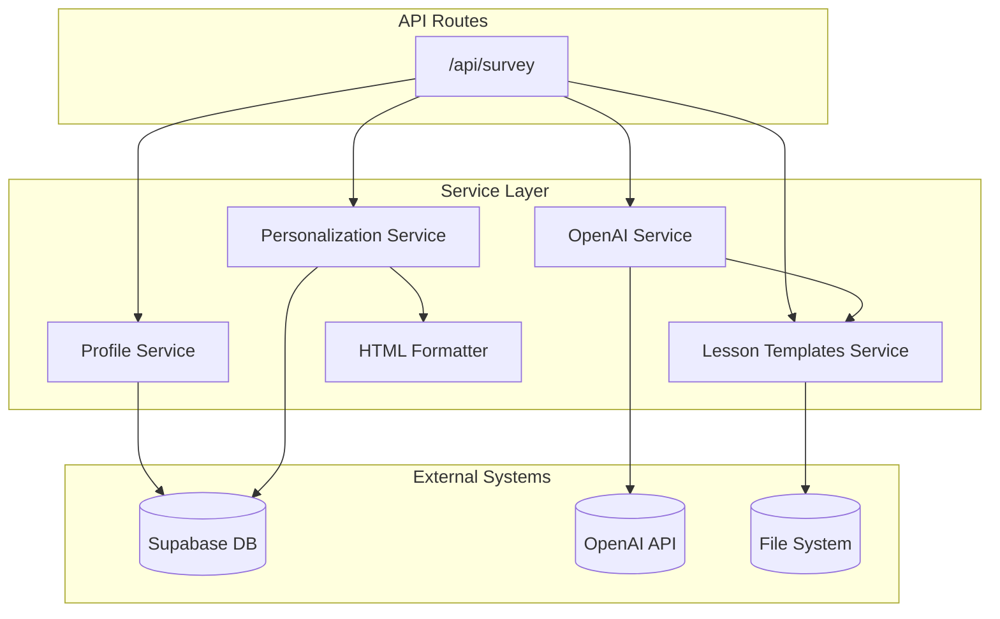
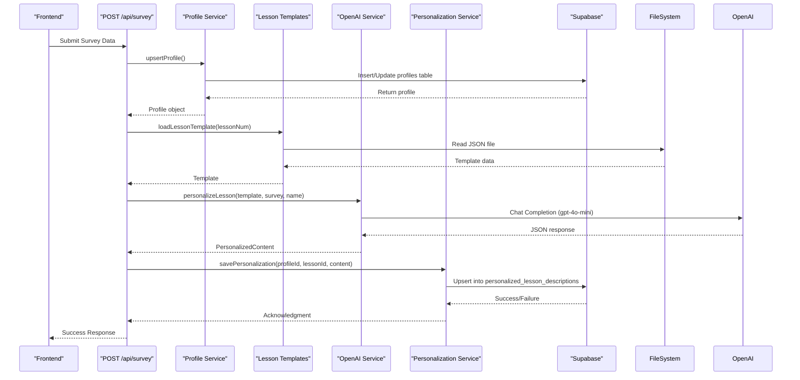

# Service Layer Architecture

<cite>
**Referenced Files in This Document**   
- [lib/services/personalization.ts](file://lib/services/personalization.ts)
- [lib/services/profile.ts](file://lib/services/profile.ts)
- [lib/services/openai.ts](file://lib/services/openai.ts)
- [lib/services/lesson-templates.ts](file://lib/services/lesson-templates.ts)
- [lib/services/html-formatter.ts](file://lib/services/html-formatter.ts)
- [app/api/survey/route.ts](file://app/api/survey/route.ts)
</cite>

## Table of Contents
1. [Introduction](#introduction)
2. [Service Layer Overview](#service-layer-overview)
3. [Core Services](#core-services)
4. [Service Interfaces](#service-interfaces)
5. [Integration Patterns](#integration-patterns)
6. [Practical Examples](#practical-examples)
7. [Troubleshooting Guide](#troubleshooting-guide)
8. [Conclusion](#conclusion)

## Introduction
The Service Layer Architecture in this application provides a modular, reusable set of business logic components that handle core functionality such as user profile management, lesson personalization, content generation, and HTML formatting. These services abstract away database interactions, external API calls, and file system operations, enabling clean separation between presentation and business logic.

This document details the architecture, interfaces, integration patterns, and practical usage of these services, with a focus on reliability, error handling, and extensibility.

**Section sources**
- [lib/services/personalization.ts](file://lib/services/personalization.ts#L1-L140)
- [lib/services/profile.ts](file://lib/services/profile.ts#L1-L130)

## Service Layer Overview

The service layer is organized into five primary modules, each responsible for a distinct domain of functionality:

- **Personalization Service**: Manages storage and retrieval of personalized lesson content
- **Profile Service**: Handles user profile creation, updates, and data access
- **OpenAI Service**: Orchestrates AI-driven personalization using GPT models
- **Lesson Templates Service**: Loads and manages lesson template data from the file system
- **HTML Formatter Service**: Converts structured content into styled HTML blocks

These services are designed to be stateless, composable, and resilient to failures, particularly when integrating with external systems like Supabase and OpenAI.



**Diagram sources**
- [lib/services/personalization.ts](file://lib/services/personalization.ts#L1-L140)
- [lib/services/profile.ts](file://lib/services/profile.ts#L1-L130)
- [lib/services/openai.ts](file://lib/services/openai.ts#L1-L138)
- [lib/services/lesson-templates.ts](file://lib/services/lesson-templates.ts#L1-L101)
- [lib/services/html-formatter.ts](file://lib/services/html-formatter.ts#L1-L108)
- [app/api/survey/route.ts](file://app/api/survey/route.ts#L1-L132)

## Core Services

### Personalization Service
Handles persistence of personalized lesson content in the Supabase database. It supports upsert, retrieve, delete, and batch operations with robust error handling.

Key functions:
- `savePersonalization()`: Stores or updates personalization for a lesson
- `getPersonalization()`: Retrieves existing personalization
- `deletePersonalization()`: Removes personalization
- `batchSavePersonalizations()`: Processes multiple personalizations with individual error tracking

**Section sources**
- [lib/services/personalization.ts](file://lib/services/personalization.ts#L20-L120)

### Profile Service
Manages user profile lifecycle including creation, updates, and retrieval. Profiles are linked to user identifiers and contain survey data used for personalization.

Key functions:
- `upsertProfile()`: Creates or updates a user profile
- `getProfileByUserId()`: Retrieves full profile by user identifier
- `getProfileSurvey()`: Extracts only survey data from a profile

**Section sources**
- [lib/services/profile.ts](file://lib/services/profile.ts#L52-L108)

### OpenAI Service
Implements AI-powered personalization using OpenAI's GPT models. It generates tailored lesson content based on user survey responses and predefined templates.

Key functions:
- `personalizeLesson()`: Core function that sends prompts to OpenAI and parses JSON responses
- `getOpenAIClient()`: Ensures singleton instance of OpenAI client
- `createPersonalizationPrompt()`: Builds structured prompts in Russian for consistent output

**Section sources**
- [lib/services/openai.ts](file://lib/services/openai.ts#L88-L137)

### Lesson Templates Service
Loads lesson templates from JSON files stored in the `store/shvz` directory. Supports flexible filename patterns and provides fallback templates when files are missing.

Key functions:
- `loadLessonTemplate()`: Reads and parses template files with multiple naming patterns
- `getLessonTemplateId()`: Maps lesson numbers to UUIDs via a static lookup table
- `getDefaultTemplate()`: Provides default content when templates are unavailable

**Section sources**
- [lib/services/lesson-templates.ts](file://lib/services/lesson-templates.ts#L49-L87)

### HTML Formatter Service
Transforms structured personalization data into styled HTML blocks for rendering in the frontend. Includes specialized templates for alerts and prompts.

Key functions:
- `formatPersonalizedContent()`: Generates full HTML block from personalization data
- `formatSurveyAlert()`: Creates call-to-action for users who haven't completed the survey
- `formatPersonalizationUnavailableAlert()`: Shows fallback message when no personalization exists

**Section sources**
- [lib/services/html-formatter.ts](file://lib/services/html-formatter.ts#L5-L75)

## Service Interfaces

### Data Types and Contracts

#### PersonalizationRecord
```typescript
interface PersonalizationRecord {
  profile_id: string;
  lesson_id: string;
  content: PersonalizedContent | Record<string, unknown>;
  created_at?: string;
  updated_at?: string;
}
```

#### Profile
```typescript
interface Profile {
  id: string;
  user_identifier: string;
  name: string;
  course_slug: string;
  survey: SurveyData | Record<string, unknown>;
  created_at?: string;
  updated_at?: string;
}
```

#### PersonalizedContent
```typescript
interface PersonalizedContent {
  summary_short: string;
  why_watch: string;
  quick_action: string;
  social_share: string;
  homework_20m: string;
  prev_lessons?: string;
}
```

#### SurveyData
```typescript
interface SurveyData {
  motivation?: string[];
  target_clients?: string;
  skills_wanted?: string;
  fears?: string[];
  wow_result?: string;
  practice_model?: string;
}
```

**Section sources**
- [lib/services/personalization.ts](file://lib/services/personalization.ts#L3-L15)
- [lib/services/profile.ts](file://lib/services/profile.ts#L3-L22)
- [lib/services/openai.ts](file://lib/services/openai.ts#L18-L44)

## Integration Patterns

### End-to-End Personalization Flow



**Diagram sources**
- [app/api/survey/route.ts](file://app/api/survey/route.ts#L15-L130)
- [lib/services/profile.ts](file://lib/services/profile.ts#L52-L108)
- [lib/services/lesson-templates.ts](file://lib/services/lesson-templates.ts#L49-L87)
- [lib/services/openai.ts](file://lib/services/openai.ts#L88-L137)
- [lib/services/personalization.ts](file://lib/services/personalization.ts#L20-L47)

### Error Handling Strategy
All services implement consistent error handling:
- Try/catch blocks around async operations
- Detailed logging of errors
- Graceful fallbacks (e.g., default templates)
- Non-breaking behavior (return null instead of throwing)

### Resilience Features
- OpenAI service returns fallback content on API failure
- Template loader tries multiple filename patterns
- Batch operations track individual item success/failure
- Database operations use upsert patterns to avoid duplicates

**Section sources**
- [lib/services/openai.ts](file://lib/services/openai.ts#L100-L137)
- [lib/services/lesson-templates.ts](file://lib/services/lesson-templates.ts#L60-L87)
- [lib/services/personalization.ts](file://lib/services/personalization.ts#L90-L120)

## Practical Examples

### Creating a New User Profile
```typescript
import { upsertProfile } from "@/lib/services/profile";

const profileData = {
  user_identifier: "user_123",
  name: "John Doe",
  course_slug: "massage-course",
  survey: {
    motivation: ["career_change"],
    target_clients: "middle_aged_women",
    skills_wanted: "relaxation_techniques",
    fears: ["hurting_clients"],
    wow_result: "help_clients_relax",
    practice_model: "partner"
  }
};

const profile = await upsertProfile(profileData);
if (profile) {
  console.log("Profile created/updated:", profile.id);
}
```

**Section sources**
- [lib/services/profile.ts](file://lib/services/profile.ts#L52-L108)

### Generating Personalized Lesson Content
```typescript
import { loadLessonTemplate } from "@/lib/services/lesson-templates";
import { personalizeLesson } from "@/lib/services/openai";

const template = await loadLessonTemplate(1);
const lessonInfo = { lesson_number: 1, title: "Introduction to Massage" };

const personalization = await personalizeLesson(
  template,
  surveyData,
  "John Doe",
  lessonInfo
);

console.log("Personalized content:", personalization);
```

**Section sources**
- [lib/services/lesson-templates.ts](file://lib/services/lesson-templates.ts#L49-L87)
- [lib/services/openai.ts](file://lib/services/openai.ts#L88-L137)

### Rendering Personalized HTML
```typescript
import { formatPersonalizedContent } from "@/lib/services/html-formatter";

const html = formatPersonalizedContent(personalization);
document.getElementById("content").innerHTML = html;
```

**Section sources**
- [lib/services/html-formatter.ts](file://lib/services/html-formatter.ts#L5-L58)

## Troubleshooting Guide

### Common Issues and Solutions

#### Issue: Personalization Not Saving
**Symptoms**: No entries in `personalized_lesson_descriptions` table  
**Causes**: 
- Invalid profile ID or lesson ID
- Supabase permissions issue
- Network connectivity problems  
**Solutions**: 
- Verify profile and lesson IDs exist
- Check Supabase logs for error details
- Ensure `personalized_lesson_descriptions` table has proper RLS policies

**Section sources**
- [lib/services/personalization.ts](file://lib/services/personalization.ts#L20-L47)

#### Issue: OpenAI API Timeout
**Symptoms**: Fallback template content being used  
**Causes**: 
- OpenAI API key not set
- Rate limiting
- Invalid prompt format  
**Solutions**: 
- Verify `OPENAI_API_KEY` environment variable
- Check usage quotas in OpenAI dashboard
- Review prompt construction in `createPersonalizationPrompt`

**Section sources**
- [lib/services/openai.ts](file://lib/services/openai.ts#L100-L137)

#### Issue: Template File Not Found
**Symptoms**: Default template used instead of custom content  
**Causes**: 
- Incorrect filename pattern
- File not present in `store/shvz` directory
- Wrong lesson number mapping  
**Solutions**: 
- Check `LESSON_ID_MAP` in `lesson-templates.ts`
- Verify file exists with one of the supported patterns
- Ensure correct file permissions

**Section sources**
- [lib/services/lesson-templates.ts](file://lib/services/lesson-templates.ts#L49-L87)

#### Issue: Profile Not Found
**Symptoms**: `getProfileByUserId()` returns null  
**Causes**: 
- User identifier mismatch
- Profile not created via survey flow
- Database sync issues  
**Solutions**: 
- Verify the `user_identifier` matches exactly
- Ensure survey endpoint was called successfully
- Check Supabase `profiles` table directly

**Section sources**
- [lib/services/profile.ts](file://lib/services/profile.ts#L24-L46)

## Conclusion
The Service Layer Architecture provides a robust foundation for user personalization in the educational platform. By separating concerns into distinct services, the system achieves high maintainability, testability, and resilience. The integration between Supabase, OpenAI, and the file system enables dynamic content generation while maintaining performance through fallback mechanisms and error tolerance.

Key strengths include:
- Clear separation of concerns
- Comprehensive error handling
- Flexible template system
- Scalable batch operations
- Consistent interface patterns

This architecture supports both current functionality and future enhancements such as multi-course support, A/B testing of prompts, and enhanced analytics.