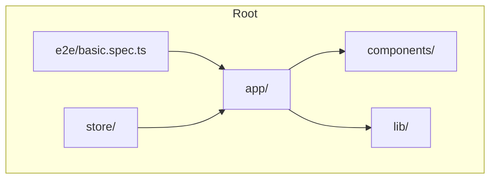
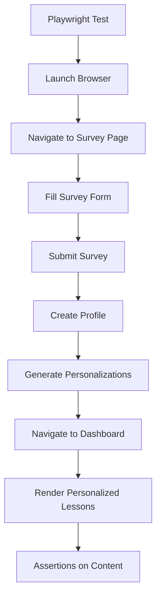
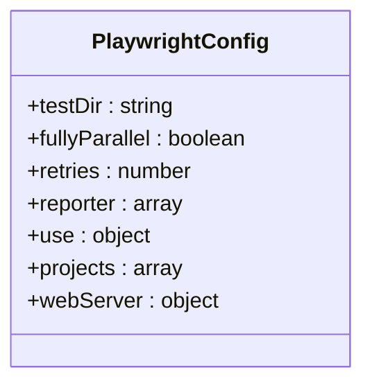
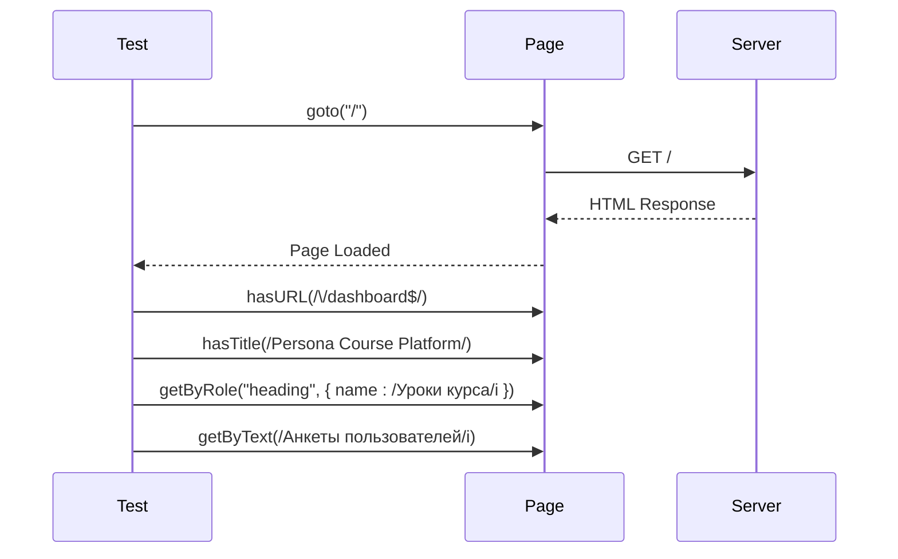
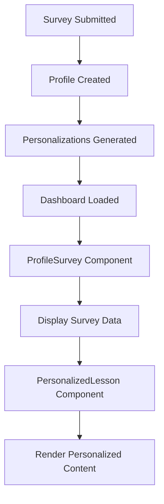
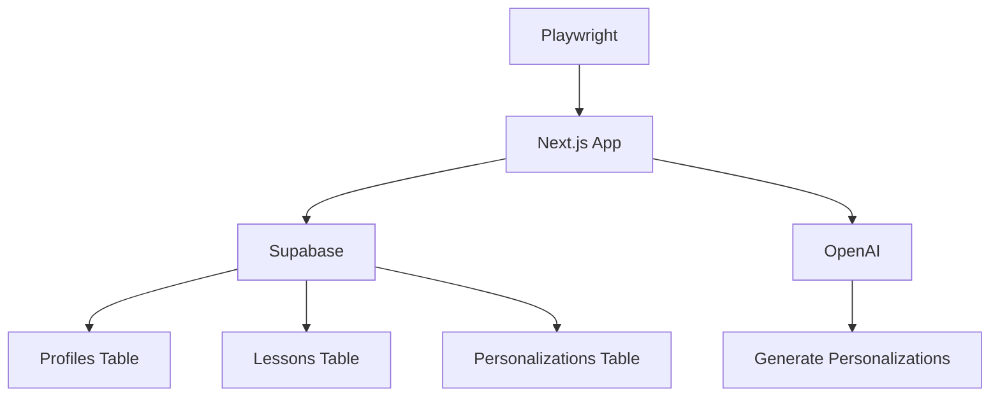

# End-to-End Testing

<cite>
**Referenced Files in This Document**   
- [basic.spec.ts](file://e2e/basic.spec.ts)
- [playwright.config.ts](file://playwright.config.ts)
- [profile-survey.tsx](file://components/profiles/profile-survey.tsx)
- [page.tsx](file://app/survey/iframe/page.tsx)
- [route.ts](file://app/api/survey/route.ts)
- [dashboard/page.tsx](file://app/(dashboard)/dashboard/page.tsx)
- [profile/[profileId]/page.tsx](file://app/(dashboard)/profile/[profileId]/page.tsx)
</cite>

## Table of Contents
1. [Introduction](#introduction)
2. [Project Structure](#project-structure)
3. [Core Components](#core-components)
4. [Architecture Overview](#architecture-overview)
5. [Detailed Component Analysis](#detailed-component-analysis)
6. [Dependency Analysis](#dependency-analysis)
7. [Performance Considerations](#performance-considerations)
8. [Troubleshooting Guide](#troubleshooting-guide)
9. [Conclusion](#conclusion)

## Introduction
This document provides comprehensive API documentation for the end-to-end testing suite implemented with Playwright. It details how the test suite validates critical user journeys such as survey submission, profile creation, and personalized lesson rendering. The configuration in playwright.config.ts is explained, including browser targets, test timeouts, and CI/CD integration settings. The interaction between tests and real UI components like profile-survey.tsx is covered, along with navigation through pages including /survey and /dashboard. The document includes examples of locator strategies, form submissions, and assertions on personalized content. Execution modes (headed/headless), screenshot/video capture for debugging, and parallel test running are addressed. Common failures like element not found, navigation timeouts, and state persistence issues are discussed. Guidelines for adding new E2E scenarios and maintaining test resilience against UI changes are provided.

## Project Structure
The project structure is organized to support a Next.js application with a focus on personalized course delivery. The e2e directory contains the Playwright test suite, while the app directory houses the application pages and components. The components directory includes reusable UI components, and the lib directory contains utility functions and API clients. The store directory holds lesson data and user profiles.

**Diagram sources**
- [basic.spec.ts](file://e2e/basic.spec.ts)
- [page.tsx](file://app/survey/iframe/page.tsx)
- [components/profiles/profile-survey.tsx](file://components/profiles/profile-survey.tsx)

**Section sources**
- [basic.spec.ts](file://e2e/basic.spec.ts)
- [playwright.config.ts](file://playwright.config.ts)

## Core Components
The core components of the end-to-end testing suite include the Playwright configuration file, the test file, and the UI components that are tested. The playwright.config.ts file defines the test directory, browser targets, and CI/CD integration settings. The basic.spec.ts file contains the actual test cases that validate user journeys. The UI components such as profile-survey.tsx and the survey and dashboard pages are the targets of these tests.

**Section sources**
- [basic.spec.ts](file://e2e/basic.spec.ts)
- [playwright.config.ts](file://playwright.config.ts)
- [profile-survey.tsx](file://components/profiles/profile-survey.tsx)

## Architecture Overview
The architecture of the end-to-end testing suite is designed to validate the complete user journey from survey submission to personalized lesson rendering. The tests are executed in a headless browser environment, with the ability to capture screenshots and videos for debugging. The suite is configured to run in parallel, with retries enabled in CI environments. The tests interact with the application through the UI, simulating real user actions.

**Diagram sources**
- [basic.spec.ts](file://e2e/basic.spec.ts)
- [playwright.config.ts](file://playwright.config.ts)
- [page.tsx](file://app/survey/iframe/page.tsx)
- [route.ts](file://app/api/survey/route.ts)

## Detailed Component Analysis

### Test Configuration Analysis
The Playwright configuration is defined in playwright.config.ts and sets up the test environment. It specifies the test directory, enables full parallelization, and configures retries based on the environment. The reporter is set to list and HTML, with the HTML report opening only in non-CI environments. The base URL is set to the local development server, and tracing and video recording are configured for failure analysis. The web server is started automatically before tests run.

**Diagram sources**
- [playwright.config.ts](file://playwright.config.ts)

### Survey Submission Test Analysis
The basic.spec.ts file contains a test that validates the dashboard loads the lessons list. The test navigates to the root URL, asserts the URL and title, and checks for the presence of specific headings and text. This test ensures that the application is correctly rendering the dashboard after a user journey.

**Diagram sources**
- [basic.spec.ts](file://e2e/basic.spec.ts)

### UI Component Interaction Analysis
The tests interact with real UI components such as the profile-survey.tsx component. This component displays the user's survey data in a formatted way. The tests validate that the survey data is correctly displayed and that the personalized lessons are rendered based on the survey responses.

**Diagram sources**
- [profile-survey.tsx](file://components/profiles/profile-survey.tsx)
- [dashboard/page.tsx](file://app/(dashboard)/dashboard/page.tsx)
- [profile/[profileId]/page.tsx](file://app/(dashboard)/profile/[profileId]/page.tsx)

## Dependency Analysis
The end-to-end testing suite depends on several external and internal components. The primary external dependency is Playwright, which is used for browser automation. The suite also depends on the Next.js application, which provides the UI components and API endpoints. The tests interact with the Supabase database through the API endpoints, creating and updating profiles and personalizations.

**Diagram sources**
- [playwright.config.ts](file://playwright.config.ts)
- [route.ts](file://app/api/survey/route.ts)
- [lib/supabase/server.ts](file://lib/supabase/server.ts)

**Section sources**
- [playwright.config.ts](file://playwright.config.ts)
- [route.ts](file://app/api/survey/route.ts)

## Performance Considerations
The end-to-end tests are designed to run efficiently in both development and CI environments. The use of parallel execution and retries in CI ensures that tests are resilient to transient failures. The configuration of trace and video recording helps in debugging failures without significantly impacting test execution time. The web server is reused in non-CI environments to reduce startup time.

## Troubleshooting Guide
Common issues in the end-to-end testing suite include element not found errors, navigation timeouts, and state persistence issues. Element not found errors can be mitigated by using robust locator strategies and waiting for elements to be visible. Navigation timeouts can be addressed by increasing the timeout values or optimizing the application's performance. State persistence issues can be resolved by ensuring that the application correctly handles user sessions and data storage.

**Section sources**
- [basic.spec.ts](file://e2e/basic.spec.ts)
- [playwright.config.ts](file://playwright.config.ts)

## Conclusion
The end-to-end testing suite provides comprehensive coverage of critical user journeys in the application. The configuration and test cases are designed to be resilient and efficient, with robust error handling and debugging capabilities. The suite interacts with real UI components and API endpoints, ensuring that the application behaves as expected in real-world scenarios. By following the guidelines provided in this document, new E2E scenarios can be added and maintained with confidence.