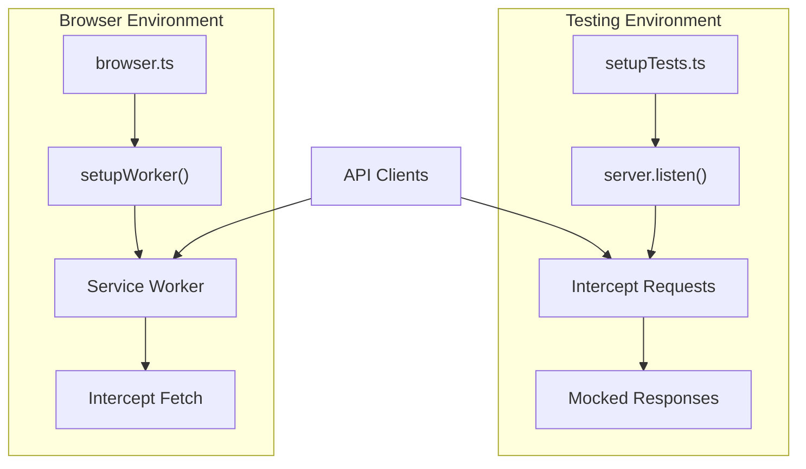
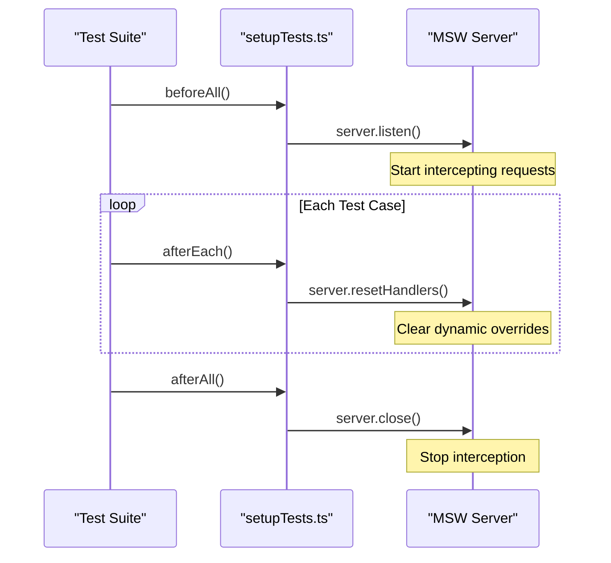

# Integration Testing

<cite>
**Referenced Files in This Document**   
- [handlers.ts](file://msw/handlers.ts)
- [server.ts](file://msw/server.ts)
- [browser.ts](file://msw/browser.ts)
- [setupTests.ts](file://test/setupTests.ts)
- [route.ts](file://app/api/persona/personalize-template/route.ts)
- [route.ts](file://app/api/profiles/[profileId]/personalizations/route.ts)
- [personalizations.ts](file://lib/api/personalizations.ts)
- [personalization-editor.tsx](file://components/personalizations/personalization-editor.tsx)
- [profile-survey.tsx](file://components/profiles/profile-survey.tsx)
</cite>

## Table of Contents
1. [Introduction](#introduction)
2. [MSW Setup and Environment Configuration](#msw-setup-and-environment-configuration)
3. [Request Handlers for API Mocking](#request-handlers-for-api-mocking)
4. [Integration Test Setup and Lifecycle Management](#integration-test-setup-and-lifecycle-management)
5. [Simulating Personalization Workflows](#simulating-personalization-workflows)
6. [Error Simulation and Edge Case Testing](#error-simulation-and-edge-case-testing)
7. [Common Challenges in MSW Integration Testing](#common-challenges-in-msw-integration-testing)
8. [Best Practices for Maintaining Mock Fidelity](#best-practices-for-maintaining-mock-fidelity)
9. [Conclusion](#conclusion)

## Introduction
This document details the integration testing strategy using Mock Service Worker (MSW) to simulate backend interactions with Supabase and OpenAI services. The approach enables reliable, isolated testing of frontend components by intercepting HTTP requests in both Node.js and browser environments. Special focus is placed on validating data flow during user personalization workflows, particularly through the `/api/persona/personalize-template` endpoint and profile management APIs.

## MSW Setup and Environment Configuration
The MSW integration is configured separately for server and browser environments using two distinct entry points: `server.ts` and `browser.ts`. In the Node.js environment, `setupServer` from `msw/node` is used to create a server-side request interception layer, while the browser environment uses `setupWorker` from `msw/browser` to handle requests via a service worker.

The `server.ts` file initializes a shared `setupServer` instance using the handlers defined in `handlers.ts`, enabling interception of API calls during unit and integration tests. Conversely, `browser.ts` configures a service worker using `setupWorker`, allowing real-time interception of fetch requests in the browser during end-to-end or component testing.

**Diagram sources**
- [server.ts](file://msw/server.ts#L1-L8)
- [browser.ts](file://msw/browser.ts#L1-L8)

**Section sources**
- [server.ts](file://msw/server.ts#L1-L8)
- [browser.ts](file://msw/browser.ts#L1-L8)

## Request Handlers for API Mocking
All mocked API responses are defined in `handlers.ts` using MSW’s `http` request handlers. Currently, the only implemented handler intercepts GET requests to `/api/health` and returns a static JSON response indicating service availability. However, for full integration testing coverage, additional handlers should be added to simulate responses from `/api/persona/personalize-template` and profile-related endpoints such as `/api/profiles/[profileId]/personalizations`.

To support personalization workflows, request handlers must simulate:
- Successful personalization responses containing HTML content
- Profile data retrieval with survey responses
- Error conditions such as missing user IDs or invalid lesson numbers

Extending the `handlers` array to include POST and GET handlers for these endpoints ensures realistic simulation of backend behavior.

**Section sources**
- [handlers.ts](file://msw/handlers.ts#L1-L11)
- [route.ts](file://app/api/persona/personalize-template/route.ts#L1-L293)
- [route.ts](file://app/api/profiles/[profileId]/personalizations/route.ts#L1-L32)

## Integration Test Setup and Lifecycle Management
The `setupTests.ts` file serves as the global test setup script executed before all Vitest suites. It configures the MSW server instance imported from `msw/server.ts` and manages its lifecycle using Vitest’s `beforeAll`, `afterEach`, and `afterAll` hooks.

During test execution:
- `beforeAll()` starts the mock server and configures it to throw errors on unhandled requests, ensuring all API interactions are explicitly mocked.
- `afterEach()` resets any runtime request handler overrides, maintaining isolation between test cases.
- `afterAll()` shuts down the server to prevent memory leaks.

This setup ensures that every test runs in a clean, predictable environment where external dependencies are fully controlled.

**Diagram sources**
- [setupTests.ts](file://test/setupTests.ts#L1-L11)

**Section sources**
- [setupTests.ts](file://test/setupTests.ts#L1-L11)

## Simulating Personalization Workflows
Personalization workflows are initiated when the frontend requests content from `/api/persona/personalize-template`. To validate correct data flow, integration tests must simulate this endpoint returning properly formatted HTML containing personalized lesson elements such as `summary_short`, `why_watch`, and `homework_20m`.

The `personalization-editor.tsx` component demonstrates how the frontend consumes and edits personalization data. Integration tests should verify that:
- The editor correctly displays existing personalizations
- Save operations trigger appropriate API calls
- UI updates reflect successful persistence

By mocking the response from `GET /api/profiles/[profileId]/personalizations`, tests can simulate various user states and ensure the editor renders accurately.

**Section sources**
- [route.ts](file://app/api/persona/personalize-template/route.ts#L1-L293)
- [personalizations.ts](file://lib/api/personalizations.ts#L1-L28)
- [personalization-editor.tsx](file://components/personalizations/personalization-editor.tsx#L1-L157)

## Error Simulation and Edge Case Testing
Robust integration testing requires simulating error conditions such as:
- Missing `user_id` or `lesson_number` in personalization requests
- Supabase profile lookup failures
- OpenAI API timeouts or authentication errors
- Invalid JSON responses from AI-generated content

These scenarios can be tested by defining conditional logic within MSW handlers. For example, a handler can return a 400 status for malformed requests or simulate delayed responses using `sleep()` to test loading states.

Additionally, the `profile-survey.tsx` component should be tested under conditions where survey data is null or incomplete, ensuring graceful degradation in the UI.

**Section sources**
- [route.ts](file://app/api/persona/personalize-template/route.ts#L1-L293)
- [profile-survey.tsx](file://components/profiles/profile-survey.tsx#L1-L66)

## Common Challenges in MSW Integration Testing
Several challenges arise when using MSW for integration testing:

1. **Handler Conflicts**: Multiple test suites may define overlapping handlers, leading to unpredictable behavior. This is mitigated by resetting handlers after each test using `server.resetHandlers()`.

2. **Timing Issues**: Asynchronous operations like OpenAI calls may cause race conditions. Using `delay()` in handlers helps simulate real-world latency and validate loading state handling.

3. **Mock Fidelity**: Over-simplified mocks may fail to reflect actual API contracts. Regular synchronization with backend changes is essential to maintain accuracy.

4. **Environment Differences**: Browser and server mocks may behave differently due to service worker limitations. Cross-environment validation ensures consistency.

**Section sources**
- [handlers.ts](file://msw/handlers.ts#L1-L11)
- [setupTests.ts](file://test/setupTests.ts#L1-L11)

## Best Practices for Maintaining Mock Fidelity
To ensure mocks remain aligned with actual API behavior:
- Regularly compare mock responses with real API outputs
- Use shared TypeScript types (e.g., from `lib/supabase/types.ts`) in handler definitions
- Automate contract validation using tools like OpenAPI or JSON Schema
- Document known discrepancies between mock and production behavior
- Isolate complex logic in reusable utility functions for consistent mocking

Additionally, consider implementing versioned mocks for different API states and using environment variables to toggle between mock modes (e.g., success, error, delay).

**Section sources**
- [handlers.ts](file://msw/handlers.ts#L1-L11)
- [lib/supabase/types.ts](file://lib/supabase/types.ts)

## Conclusion
The MSW-based integration testing approach provides a robust framework for validating frontend-backend interactions without relying on external services. By intercepting requests to Supabase and OpenAI endpoints, the system enables comprehensive testing of personalization workflows, error handling, and data flow integrity. With proper lifecycle management and high-fidelity mocks, this strategy ensures reliable, maintainable tests that reflect real-world usage patterns.