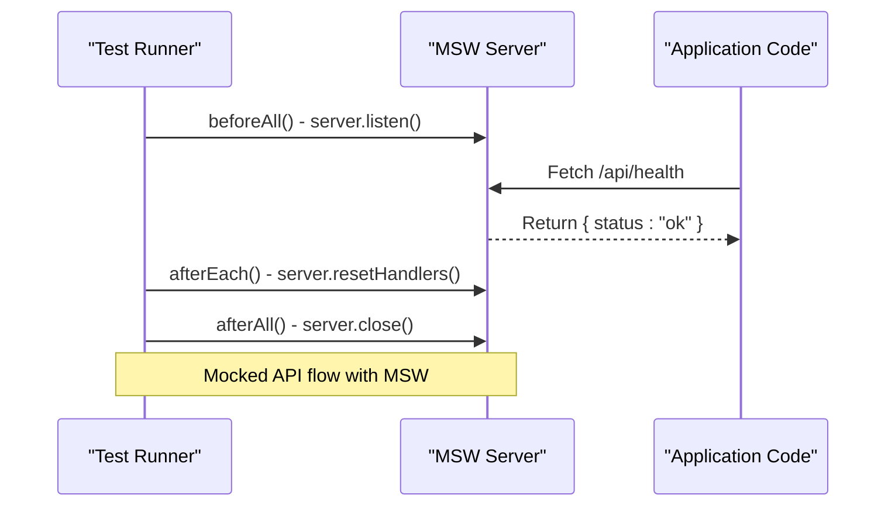

# Testing Strategy

<cite>
**Referenced Files in This Document**   
- [vitest.config.ts](file://vitest.config.ts)
- [playwright.config.ts](file://playwright.config.ts)
- [setupTests.ts](file://test/setupTests.ts)
- [handlers.ts](file://msw/handlers.ts)
- [server.ts](file://msw/server.ts)
- [browser.ts](file://msw/browser.ts)
- [app.test.tsx](file://test/app/app.test.tsx)
- [env.test.ts](file://test/env/env.test.ts)
- [basic.spec.ts](file://e2e/basic.spec.ts)
- [utils.ts](file://lib/utils.ts)
</cite>

## Table of Contents
1. [Introduction](#introduction)
2. [Unit Testing with Vitest](#unit-testing-with-vitest)
3. [End-to-End Testing with Playwright](#end-to-end-testing-with-playwright)
4. [API Mocking with MSW](#api-mocking-with-msw)
5. [Test Organization and Structure](#test-organization-and-structure)
6. [Test Configuration](#test-configuration)
7. [Code Coverage and CI Integration](#code-coverage-and-ci-integration)
8. [Writing and Extending Tests](#writing-and-extending-tests)
9. [Conclusion](#conclusion)

## Introduction
The persona application employs a comprehensive testing strategy to ensure reliability, maintainability, and correctness across all layers of the system. This document details the testing approach, covering unit testing for utility functions and components, end-to-end (E2E) testing for critical user journeys, and API mocking to isolate tests from external dependencies such as Supabase and OpenAI. The test suite is structured to support continuous integration and scalable test development as new features are added.

## Unit Testing with Vitest

The unit testing strategy leverages **Vitest**, a fast and modern test runner optimized for Vite-based projects. Unit tests are primarily focused on validating pure functions in the `lib/` directory and testing UI components in isolation. The `test/` directory contains unit test files with the `.test.ts` or `.test.tsx` extension, organized by feature or module.

Key aspects of the unit testing setup include:
- Use of `jsdom` environment to simulate browser-like conditions for React component testing
- Global test utilities from `@testing-library/react` and `@testing-library/jest-dom` for accessible DOM assertions
- Setup and teardown hooks via `setupTests.ts` to initialize and clean up test state
- Support for CSS module resolution during testing to ensure styling integrity

The test suite includes basic validation of environment variables and component rendering behavior, ensuring foundational logic remains stable.

**Section sources**
- [vitest.config.ts](file://vitest.config.ts#L0-L27)
- [test/app/app.test.tsx](file://test/app/app.test.tsx#L0-L10)
- [test/env/env.test.ts](file://test/env/env.test.ts#L0-L7)
- [test/setupTests.ts](file://test/setupTests.ts#L0-L11)

## End-to-End Testing with Playwright

End-to-end testing is implemented using **Playwright**, a powerful browser automation tool that enables reliable testing of real user interactions. The E2E tests are located in the `e2e/` directory and focus on critical user journeys such as survey submission and lesson personalization.

The current test suite verifies:
- Successful navigation to the dashboard
- Correct page title and content rendering
- Visibility of key UI elements like lesson lists and user survey sections

Playwright runs tests in Chromium by default and supports video recording and trace collection for debugging, especially in CI environments. The `webServer` configuration ensures the application is automatically started before tests and remains available throughout the test run.

**Section sources**
- [playwright.config.ts](file://playwright.config.ts#L0-L27)
- [e2e/basic.spec.ts](file://e2e/basic.spec.ts#L0-L10)

## API Mocking with MSW

To decouple tests from external services like Supabase and OpenAI, the application uses **Mock Service Worker (MSW)** for API mocking. MSW intercepts HTTP requests at the network level, allowing tests to simulate backend responses without making real API calls.

The MSW setup includes:
- A shared `handlers.ts` file defining mock request handlers
- A Node.js server instance (`server.ts`) used in unit and integration tests
- A browser worker (`browser.ts`) for client-side mocking in development or browser testing

The `setupTests.ts` file initializes the MSW server before all tests, ensures unhandled requests are flagged as errors, and resets handlers after each test to prevent state leakage.

This approach enables consistent, fast, and deterministic testing of API-dependent functionality.



**Diagram sources**
- [msw/handlers.ts](file://msw/handlers.ts#L0-L11)
- [msw/server.ts](file://msw/server.ts#L0-L8)
- [test/setupTests.ts](file://test/setupTests.ts#L0-L11)

**Section sources**
- [msw/handlers.ts](file://msw/handlers.ts#L0-L11)
- [msw/server.ts](file://msw/server.ts#L0-L8)
- [msw/browser.ts](file://msw/browser.ts#L0-L8)

## Test Organization and Structure

The test suite is organized into logical directories:
- `test/app/`: Component and page-level unit tests
- `test/env/`: Environment variable validation and configuration tests
- `test/setupTests.ts`: Global test setup and MSW integration
- `e2e/`: Playwright-based end-to-end tests simulating user flows

This structure promotes clarity and scalability, making it easy to locate tests for specific features and add new ones as the application evolves.

**Section sources**
- [test/app/app.test.tsx](file://test/app/app.test.tsx#L0-L10)
- [test/env/env.test.ts](file://test/env/env.test.ts#L0-L7)
- [e2e/basic.spec.ts](file://e2e/basic.spec.ts#L0-L10)

## Test Configuration

### Vitest Configuration
The `vitest.config.ts` file defines core testing behavior:
- Includes all test files under `test/**/*.test.{ts,tsx}`
- Sets up `jsdom` environment for React testing
- Applies aliases (e.g., `@/` maps to root) for consistent imports
- Enables automatic JSX transformation
- Configures JUnit reporter in CI for integration with CI/CD pipelines

### Playwright Configuration
The `playwright.config.ts` file configures E2E execution:
- Points to the `e2e/` directory as test root
- Launches the dev server on port 3210 before tests
- Enables video and trace capture on failure
- Uses HTML reporter in CI with auto-open disabled

Both configurations are designed to work seamlessly in local and CI environments.

**Section sources**
- [vitest.config.ts](file://vitest.config.ts#L0-L27)
- [playwright.config.ts](file://playwright.config.ts#L0-L27)

## Code Coverage and CI Integration

While explicit coverage thresholds are not defined in the current configuration, the test suite is structured to support coverage reporting. In CI environments, Vitest outputs results in JUnit format for integration with CI dashboards. Playwright generates HTML reports and retains failure traces and videos for debugging.

Future enhancements could include:
- Adding `--coverage` flag to generate coverage reports
- Setting minimum coverage thresholds
- Integrating with coverage visualization tools like Coveralls or Codecov

The use of retries in CI (`retries: 2`) helps mitigate flakiness in E2E tests, improving reliability.

**Section sources**
- [vitest.config.ts](file://vitest.config.ts#L0-L27)
- [playwright.config.ts](file://playwright.config.ts#L0-L27)

## Writing and Extending Tests

When adding new features, developers should follow these guidelines:
- Write unit tests for all utility functions in `lib/` using Vitest
- Test React components using `@testing-library/react` for behavior, not implementation
- Use MSW to mock API responses for any backend-dependent logic
- Add E2E tests in `e2e/` for critical user flows (e.g., survey submission, lesson access)
- Ensure new tests are included in the appropriate subdirectory and follow naming conventions

Example test structure for a new utility function:
```ts
// lib/utils.test.ts
import { myUtilityFunction } from "./utils";
import { expect, it, describe } from "vitest";

describe("myUtilityFunction", () => {
  it("returns expected output", () => {
    expect(myUtilityFunction("input")).toBe("expected");
  });
});
```

For E2E tests, always wait for navigation and assert on page state before proceeding.

**Section sources**
- [test/env/env.test.ts](file://test/env/env.test.ts#L0-L7)
- [test/app/app.test.tsx](file://test/app/app.test.tsx#L0-L10)
- [e2e/basic.spec.ts](file://e2e/basic.spec.ts#L0-L10)

## Conclusion

The persona application’s testing strategy combines fast unit testing with Vitest, robust E2E validation via Playwright, and reliable API mocking using MSW. This multi-layered approach ensures high confidence in code correctness while maintaining test speed and isolation. With clear organization and CI-ready configurations, the test suite is well-positioned to scale alongside the application’s growth.