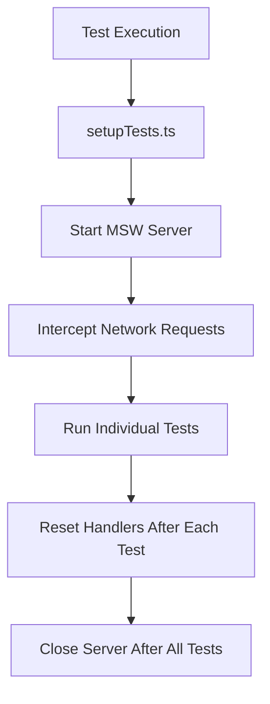
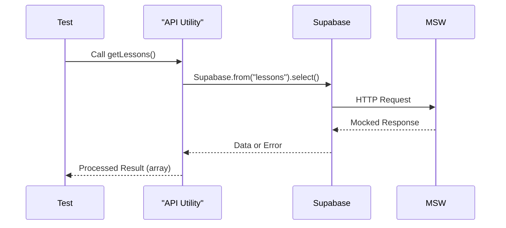

# Unit Testing

<cite>
**Referenced Files in This Document**   
- [utils.ts](file://lib/utils.ts)
- [lessons.ts](file://lib/api/lessons.ts)
- [personalizations.ts](file://lib/api/personalizations.ts)
- [profiles.ts](file://lib/api/profiles.ts)
- [setupTests.ts](file://test/setupTests.ts)
- [env.test.ts](file://test/env/env.test.ts)
- [app.test.tsx](file://test/app/app.test.tsx)
- [vitest.config.ts](file://vitest.config.ts)
</cite>

## Table of Contents
1. [Introduction](#introduction)
2. [Test Setup and Environment Configuration](#test-setup-and-environment-configuration)
3. [Testing Pure Utility Functions](#testing-pure-utility-functions)
4. [Testing API Service Utilities](#testing-api-service-utilities)
5. [Component Rendering Tests](#component-rendering-tests)
6. [Mocking Strategies and Dependency Isolation](#mocking-strategies-and-dependency-isolation)
7. [Assertion Patterns and Snapshot Testing](#assertion-patterns-and-snapshot-testing)
8. [Test Organization and Co-location Strategy](#test-organization-and-co-location-strategy)
9. [Best Practices for Writing Unit Tests](#best-practices-for-writing-unit-tests)
10. [Common Issues and Troubleshooting](#common-issues-and-troubleshooting)

## Introduction
This document outlines the unit testing strategy for the Persona application using Vitest as the primary testing framework. The focus is on ensuring reliability, maintainability, and correctness across utility functions, API service modules, and React components. The testing approach emphasizes isolation, clear assertion patterns, and robust environment configuration to support consistent test execution across development and CI environments.

## Test Setup and Environment Configuration

The test suite is initialized through `setupTests.ts`, which configures global test behavior including MSW (Mock Service Worker) integration for intercepting network requests. Before all tests run, the MSW server is started with strict handling of unmocked requests to prevent accidental external calls. After each test, handlers are reset to ensure isolation, and the server is closed after all tests complete.

Environment variables are validated in `env.test.ts` to ensure required configurations are present and correctly formatted. This includes verification of Supabase URLs, JWT structure for anon and service role keys, OpenAI API key format, and the existence of the course store directory. These checks prevent runtime failures due to misconfiguration and provide early feedback during development.

**Diagram sources**
- [setupTests.ts](file://test/setupTests.ts#L1-L12)
- [env.test.ts](file://test/env/env.test.ts#L1-L69)

**Section sources**
- [setupTests.ts](file://test/setupTests.ts#L1-L12)
- [env.test.ts](file://test/env/env.test.ts#L1-L69)

## Testing Pure Utility Functions

Pure functions in `lib/utils.ts` are tested in isolation due to their stateless nature and lack of side effects. The `cn` function, which combines Tailwind CSS classes using `clsx` and `tailwind-merge`, is verified for correct class merging behavior, including handling of conditional classes and duplicate removal. Since this function does not depend on external systems, tests are fast and deterministic.

Tests validate various input combinations, including strings, objects, arrays, and nullish values, ensuring the output is a properly merged string of class names without duplicates or invalid entries. No mocks are required for these tests, as they operate entirely on input data.

**Section sources**
- [utils.ts](file://lib/utils.ts#L1-L7)

## Testing API Service Utilities

API service utilities in `lib/api/` modules (`lessons.ts`, `personalizations.ts`, `profiles.ts`) encapsulate data fetching logic from Supabase. These functions are tested by mocking the Supabase client and verifying correct query construction, error handling, and return value formatting.

Each API function is tested under both success and error conditions. For example, `getLessons()` is tested to ensure it calls the correct Supabase table with proper ordering and includes joined `lesson_descriptions`. Error paths are validated to ensure empty arrays are returned on failure and appropriate console errors are logged. Type safety is maintained through explicit return type definitions and proper handling of nullable joined data.

Mocking is achieved via MSW, which intercepts HTTP requests made by Supabase and returns predefined responses. This allows testing of edge cases such as network failures, empty results, and malformed payloads without requiring a live database.

**Diagram sources**
- [lessons.ts](file://lib/api/lessons.ts#L1-L25)
- [personalizations.ts](file://lib/api/personalizations.ts#L1-L29)
- [profiles.ts](file://lib/api/profiles.ts#L1-L39)

**Section sources**
- [lessons.ts](file://lib/api/lessons.ts#L1-L25)
- [personalizations.ts](file://lib/api/personalizations.ts#L1-L29)
- [profiles.ts](file://lib/api/profiles.ts#L1-L39)

## Component Rendering Tests

Component rendering tests are implemented in `app.test.tsx` using `@testing-library/react`. The current test verifies that the Home page triggers a redirect by expecting a `NEXT_REDIRECT` error during render, simulating Next.js server-side redirection behavior.

Future component tests should follow the same pattern: render the component, query for specific elements, and assert expected DOM structure or behavior. Asynchronous interactions, such as data loading or form submission, can be tested using `waitFor` or `findBy` queries. Snapshot testing can be used sparingly to detect unintended UI changes, particularly for static content.

**Section sources**
- [app.test.tsx](file://test/app/app.test.tsx#L1-L11)

## Mocking Strategies and Dependency Isolation

The application uses MSW (Mock Service Worker) for API mocking, allowing realistic simulation of backend responses without external dependencies. The MSW server is set up globally in `setupTests.ts` and reset after each test to prevent mock leakage.

Critical rules include:
- All unhandled requests fail by default (`onUnhandledRequest: "error"`)
- Handlers are reset after each test to avoid state contamination
- Environment variables are pre-validated to ensure consistent test conditions

For non-HTTP dependencies (e.g., file system access in scripts), Node.js native modules like `fs` and `path` are left unmocked unless specific behaviors need to be simulated.

**Section sources**
- [setupTests.ts](file://test/setupTests.ts#L1-L12)
- [env.test.ts](file://test/env/env.test.ts#L1-L69)

## Assertion Patterns and Snapshot Testing

Assertions follow a clear and descriptive pattern using `expect()` with meaningful messages where necessary. For environment tests, custom error messages clarify missing or invalid variables. Boolean, type, and regex-based assertions are used appropriately depending on the validation target.

Snapshot testing is currently not used but could be introduced for component output where visual consistency is critical. If adopted, snapshots would be stored alongside test files and reviewed carefully during pull requests to avoid accidental acceptance of unintended changes.

**Section sources**
- [env.test.ts](file://test/env/env.test.ts#L1-L69)

## Test Organization and Co-location Strategy

Test files are organized under the `test/` directory in a structured hierarchy mirroring their purpose:
- `test/app/` contains component tests
- `test/env/` holds environment validation tests
- `test/setupTests.ts` provides global setup

This structure keeps tests discoverable and separates concerns. While some tests are co-located by feature area, there is potential to move toward file co-location (e.g., `utils.test.ts` next to `utils.ts`) for better maintainability and easier refactoring.

**Section sources**
- [test/app/app.test.tsx](file://test/app/app.test.tsx#L1-L11)
- [test/env/env.test.ts](file://test/env/env.test.ts#L1-L69)
- [test/setupTests.ts](file://test/setupTests.ts#L1-L12)

## Best Practices for Writing Unit Tests

When writing new unit tests for utility functions or pure components:
- Keep tests focused on a single behavior
- Use descriptive test names that read like specifications
- Prefer explicit assertions over broad snapshots
- Avoid testing implementation details; focus on public behavior
- Ensure 100% coverage for critical path logic, especially error handling
- Write fast, synchronous tests for pure functions
- Use `afterEach` cleanup for any manual mocks or global state changes

Performance is prioritized by avoiding unnecessary async operations in pure function tests and leveraging Vitest’s built-in optimizations like test isolation and parallel execution.

**Section sources**
- [utils.ts](file://lib/utils.ts#L1-L7)
- [lessons.ts](file://lib/api/lessons.ts#L1-L25)

## Common Issues and Troubleshooting

Common issues encountered during testing include:
- **Mock leakage**: Prevented by `server.resetHandlers()` after each test
- **Timing problems**: Addressed by using Vitest’s fake timers when testing time-dependent logic
- **Environment mismatches**: Detected early by `env.test.ts` validation suite
- **Unhandled HTTP requests**: Caught by MSW’s strict mode, forcing explicit mocking
- **Supabase type inference issues**: Handled with `@ts-expect-error` where necessary due to complex union types from joins

To troubleshoot failing tests:
1. Check if environment variables are properly loaded
2. Verify MSW handlers match the requested endpoints
3. Inspect console logs for Supabase error messages
4. Ensure test data matches expected schema shapes

**Section sources**
- [setupTests.ts](file://test/setupTests.ts#L1-L12)
- [env.test.ts](file://test/env/env.test.ts#L1-L69)