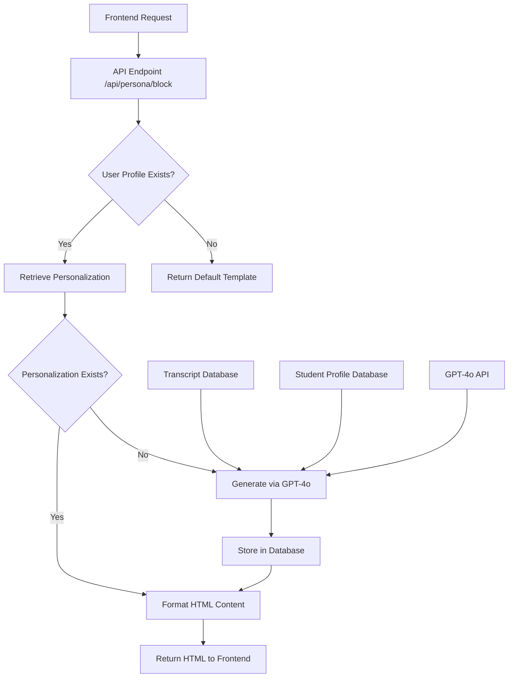

# Transcript-Driven Personalization

<cite>
**Referenced Files in This Document**   
- [personalization-engine.ts](file://lib/services/personalization-engine.ts)
- [openai.ts](file://lib/services/openai.ts)
- [lesson-templates.ts](file://lib/services/lesson-templates.ts)
- [html-formatter.ts](file://lib/services/html-formatter.ts)
- [route.ts](file://app/api/persona/block/route.ts)
- [route.ts](file://app/api/persona/personalize-template/route.ts)
- [types.ts](file://lib/supabase/types.ts)
- [lesson.json](file://store/shvz/lessons/01/lesson.json)
- [test-user-1234567-analysis.html](file://public/test-user-1234567-analysis.html)
</cite>

## Table of Contents
1. [Introduction](#introduction)
2. [System Architecture](#system-architecture)
3. [Core Components](#core-components)
4. [GPT-4o Prompt Structure](#gpt-4o-prompt-structure)
5. [Fallback Mechanisms](#fallback-mechanisms)
6. [Integration with Lesson Transcript Database](#integration-with-lesson-transcript-database)
7. [Practical Examples](#practical-examples)
8. [Troubleshooting Guide](#troubleshooting-guide)
9. [Conclusion](#conclusion)

## Introduction

The Transcript-Driven Personalization system is a sophisticated AI-powered solution designed to deliver deeply personalized lesson descriptions by analyzing full lesson transcripts in conjunction with detailed student profiles. Unlike template-based approaches, this system processes complete 8-18k character transcripts directly, enabling richer context awareness and more meaningful personalization. The system leverages GPT-4o to generate tailored content that specifically addresses individual student goals, fears, target clients, and practice models, creating a highly relevant learning experience.

This documentation provides a comprehensive overview of the system's architecture, implementation details, prompt engineering, fallback strategies, and integration with the underlying database infrastructure. The system represents a significant evolution from earlier template-based personalization methods, offering improved accuracy and relevance through direct transcript analysis.

## System Architecture

The Transcript-Driven Personalization system follows a layered architecture that integrates frontend components, API endpoints, service layers, and database interactions. The core flow begins with user identification and lesson context, proceeds through transcript retrieval and AI processing, and concludes with HTML rendering for presentation.

**Diagram sources**
- [route.ts](file://app/api/persona/block/route.ts)
- [personalization-engine.ts](file://lib/services/personalization-engine.ts)
- [types.ts](file://lib/supabase/types.ts)

**Section sources**
- [route.ts](file://app/api/persona/block/route.ts)
- [personalization-engine.ts](file://lib/services/personalization-engine.ts)

## Core Components

The system comprises several key components that work together to deliver personalized content. The primary component is the personalization engine, which orchestrates the generation process by combining lesson transcripts with student profile data. This engine interfaces with the OpenAI API to generate personalized descriptions and includes robust error handling and fallback mechanisms.

Secondary components include the HTML formatter, which transforms structured personalization data into presentable HTML, and the lesson template loader, which serves as a fallback mechanism when direct transcript processing is not available. The API endpoints provide the interface between frontend applications and the personalization logic, handling authentication, data retrieval, and response formatting.

The system also includes comprehensive logging and error reporting to facilitate troubleshooting and monitoring of the personalization pipeline.

**Section sources**
- [personalization-engine.ts](file://lib/services/personalization-engine.ts)
- [html-formatter.ts](file://lib/services/html-formatter.ts)
- [lesson-templates.ts](file://lib/services/lesson-templates.ts)

## GPT-4o Prompt Structure

The system employs a carefully crafted prompt structure that instructs GPT-4o to generate personalized content based on full lesson transcripts and student survey data. The prompt includes detailed instructions for seven distinct content sections, each designed to address specific aspects of the student's learning journey.

The prompt structure begins with lesson metadata (number and title), followed by the complete transcript (including character count), and the student's survey responses. The AI is then instructed to generate content in seven specific sections: introduction, why it matters for you, key takeaways, practical application, addressing fears, personalized homework, and motivational quote.

Each section has specific requirements for length, content, and personalization depth, ensuring consistent output quality. The prompt emphasizes the use of concrete examples from the transcript and direct references to the student's profile data, avoiding generic statements.

**Diagram sources**
- [personalization-engine.ts](file://lib/services/personalization-engine.ts)
- [openai.ts](file://lib/services/openai.ts)

**Section sources**
- [personalization-engine.ts](file://lib/services/personalization-engine.ts#L95-L265)

## Fallback Mechanisms

The system implements multiple layers of fallback mechanisms to ensure reliable operation even when primary processes fail. The primary fallback occurs when transcript processing fails or the transcript is too short (less than 1,000 characters), in which case the system generates a basic personalized description using available profile data.

A secondary fallback mechanism activates when the user profile is not found in the database. In this case, the system returns a default lesson template with a call-to-action prompting the user to complete their survey. This ensures that users always receive relevant content, even without a complete profile.

The system also includes a retry mechanism for AI generation failures. When the initial GPT-4o call fails, the system automatically retries with adjusted parameters (reduced temperature) to improve success rates. Only after a second failure does the system return the fallback content.

Additional fallbacks handle edge cases such as malformed AI responses, empty transcripts, and database connectivity issues, ensuring graceful degradation rather than complete failure.

**Diagram sources**
- [personalization-engine.ts](file://lib/services/personalization-engine.ts)
- [html-formatter.ts](file://lib/services/html-formatter.ts)

**Section sources**
- [personalization-engine.ts](file://lib/services/personalization-engine.ts#L267-L370)
- [html-formatter.ts](file://lib/services/html-formatter.ts)

## Integration with Lesson Transcript Database

The system integrates with a Supabase database that stores lesson transcripts in a structured JSONB format. Each lesson record contains the full transcription along with metadata such as length, source, and date. The system retrieves transcripts using the lesson ID, with automatic validation to ensure content quality.

The database schema includes tables for lessons, profiles, and personalized descriptions, with proper relationships and indexing to support efficient queries. The personalization engine uses Supabase server-side clients to securely access the database, with appropriate error handling for connectivity issues and data inconsistencies.

Transcripts are stored in their complete form, preserving the full context needed for deep analysis. This approach eliminates the information loss associated with compressed summaries or intermediate templates, allowing the AI to make nuanced connections between lesson content and student profiles.

The integration also supports batch operations and caching to optimize performance, particularly for frequently accessed lessons.

**Diagram sources**
- [types.ts](file://lib/supabase/types.ts)
- [personalization-engine.ts](file://lib/services/personalization-engine.ts#L63-L93)

**Section sources**
- [types.ts](file://lib/supabase/types.ts)
- [personalization-engine.ts](file://lib/services/personalization-engine.ts)

## Practical Examples

The system's effectiveness can be observed in practical implementations where personalized content directly reflects both lesson content and student profiles. For example, a student whose survey indicates fears about "hurting clients" and a practice model of "working on mom" receives content that specifically addresses safety techniques and includes examples relevant to family practice.

Another example shows how the system connects lesson content about neck massage techniques to a student's goal of "removing headaches and neck pain" for "office workers." The generated content references specific techniques from the transcript while framing them in the context of the student's target clientele.

The HTML formatter ensures consistent presentation across different content sources, transforming both AI-generated personalizations and default templates into a unified visual style. This consistency enhances user experience regardless of whether personalized content is available.

The test files in the public directory demonstrate various scenarios, including complete personalization, fallback templates, and error states, providing a comprehensive view of the system's behavior under different conditions.

**Section sources**
- [test-user-1234567-analysis.html](file://public/test-user-1234567-analysis.html)
- [html-formatter.ts](file://lib/services/html-formatter.ts)

## Troubleshooting Guide

When troubleshooting the Transcript-Driven Personalization system, begin by verifying the availability of key components: user profile, lesson transcript, and API connectivity. Common issues include missing profiles, empty transcripts, and AI service timeouts.

For personalization failures, check the server logs for error messages related to transcript loading or OpenAI API calls. The system logs detailed information about each processing step, including success and failure indicators for transcript retrieval, AI generation, and database operations.

If users receive default templates instead of personalized content, verify that their profile exists in the database and contains complete survey data. The system returns default templates when profiles are missing or when personalization records have not yet been generated.

For malformed content issues, examine the AI response structure and the normalization process. The system includes validation logic to handle inconsistent AI outputs, but extreme cases may require prompt adjustments or parameter tuning.

Performance issues can often be addressed by reviewing database query patterns and ensuring proper indexing on frequently accessed fields such as user_identifier and lesson_number.

**Section sources**
- [personalization-engine.ts](file://lib/services/personalization-engine.ts)
- [route.ts](file://app/api/persona/block/route.ts)
- [openai.ts](file://lib/services/openai.ts)

## Conclusion

The Transcript-Driven Personalization system represents a significant advancement in educational content customization, leveraging full lesson transcripts and detailed student profiles to generate highly relevant, personalized descriptions. By processing complete transcripts directly rather than relying on intermediate templates, the system preserves contextual richness and enables deeper semantic connections between lesson content and individual learning goals.

The architecture demonstrates careful consideration of reliability through multiple fallback mechanisms and robust error handling. The integration with the database infrastructure ensures efficient data retrieval and storage, while the well-structured prompts guide GPT-4o to produce consistent, high-quality output.

Future enhancements could include expanded personalization dimensions, multilingual support, and more sophisticated content analysis techniques. However, the current implementation already delivers substantial value by creating a more engaging and relevant learning experience for students.